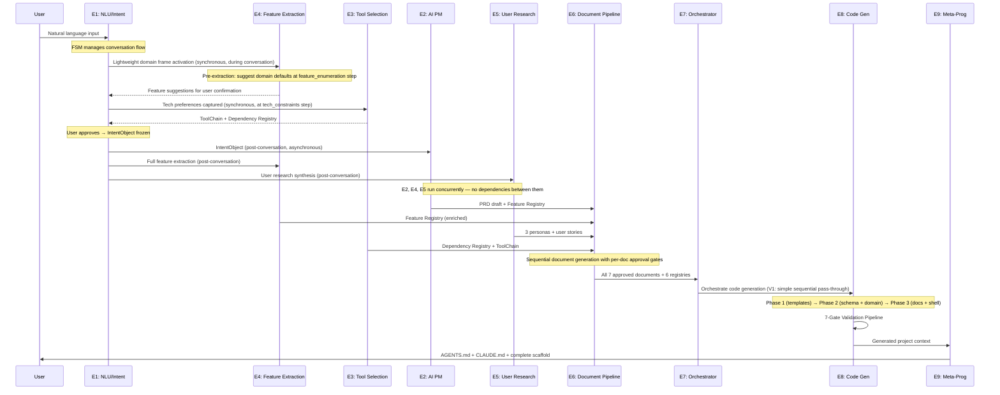
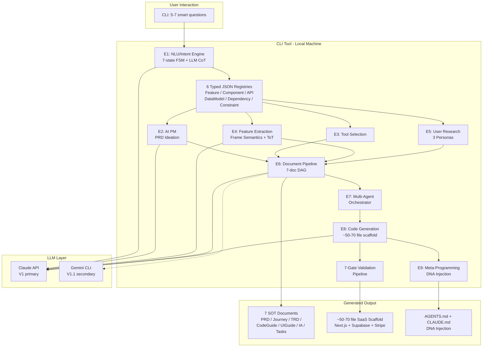
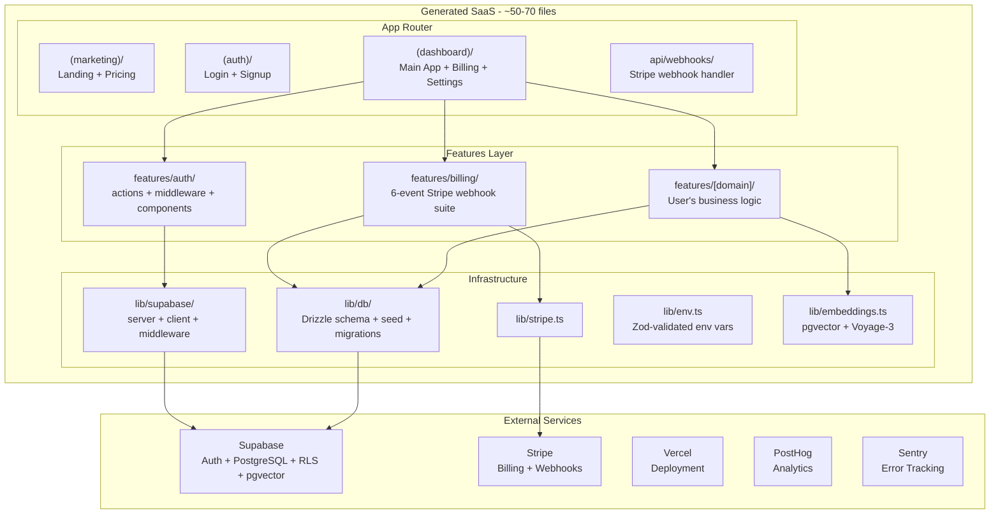
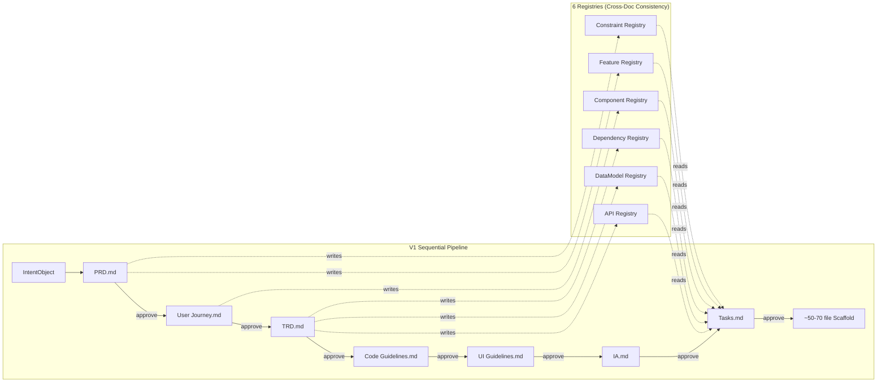

# Product Requirements Document (PRD)
# AI Agentic Workflow Automation System — "SaaS Auto-Builder"

**Version**: 1.0
**Status**: DRAFT — Awaiting Stakeholder Review
**Date**: 2026-03-13
**Author**: Product Architecture Team (78+ AI agents, 5 research rounds, 74+ documents)
**Classification**: Internal — Product Specification

---

## Table of Contents

1. [Executive Summary](#1-executive-summary)
2. [Problem Statement](#2-problem-statement)
3. [Product Vision & Goals](#3-product-vision--goals)
4. [Target Users & Personas](#4-target-users--personas)
5. [User Stories](#5-user-stories)
6. [Core Features — Detailed Specification](#6-core-features--detailed-specification)
7. [System Architecture Overview](#7-system-architecture-overview)
8. [Technology Stack](#8-technology-stack)
9. [Data Sources & Data Flow](#9-data-sources--data-flow)
10. [Integration Architecture](#10-integration-architecture)
11. [Quality & Security Strategy](#11-quality--security-strategy)
12. [Success Metrics & KPIs](#12-success-metrics--kpis)
13. [Business Model & Pricing](#13-business-model--pricing)
14. [Roadmap & Timeline](#14-roadmap--timeline)
15. [Risk Assessment](#15-risk-assessment)
16. [Appendix](#16-appendix)

---

## 1. Executive Summary

### Product Definition

SaaS Auto-Builder is a **local CLI tool** powered by Claude Code that transforms a user's natural-language SaaS idea into a production-quality, full-stack software scaffold. Users describe what they want to build in conversational language; the system understands their intent, asks 5-7 smart clarifying questions, generates 7 specification documents as intermediate representations, and produces a ~50-70 file Next.js + Supabase + Stripe SaaS scaffold ready for local development.

### The "Specification Compiler" Identity

The system's core identity is best understood through the lens of compiler theory (Aho, Sethi, Ullman — Dragon Book, 1986):

| Compiler Concept | SaaS Auto-Builder Equivalent |
|-----------------|------------------------------|
| Source Code | User intent (natural language description) |
| Front-End | E1-E5: NLU/Intent, AI PM, Tool Selection, Feature Extraction, User Research |
| Intermediate Representation (IR) | 7 SOT specification documents (PRD, User Journey, TRD, Code Guidelines, UI Guidelines, IA, Tasks) |
| Back-End | E6-E8: Document Pipeline, Multi-Agent Orchestration, Code Generation |
| Machine Code | ~50-70 file generated SaaS scaffold |
| Linker | E9: Meta-Programming — DNA injection (AGENTS.md + CLAUDE.md generation) |
| Type Checking | Zod schemas at every stage boundary — compile-time validation |

This metaphor is structurally precise, not merely illustrative. The 7-document IR decouples the front-end (intent understanding) from the back-end (code generation), enabling independent evolution of each. Zod schema validation at every stage boundary functions exactly as compile-time type checking: catching errors before they cascade through 7 documents and ~50-70 files.

### Key Differentiators

**"Lovable gives you a prototype. We give you a production architecture."**

1. **Specification-First Architecture**: No competitor produces a 7-document specification chain with cross-document consistency. Cursor is code-completion with no document pipeline. Lovable and Bolt.new generate code directly from prompts, bypassing architectural thinking entirely.

2. **Local Execution, Zero Lock-In**: The tool runs entirely on the user's local machine. No cloud dependency, no vendor lock-in, no privacy risk, offline capable. Users own every generated line of code.

3. **Registry-Driven Cross-Document Consistency**: 6 typed JSON registries (Feature, Component, API, DataModel, Dependency, Constraint) ensure that all 7 documents are structurally consistent — enforced by deterministic Zod schema validation, not LLM self-checking.

4. **BYOK Economics**: Users bring their own Anthropic API key. Per-project generation costs are $4-$9 (full pipeline with prompt caching). No surprise bills, no token hemorrhaging. Transparent cost under user control.

5. **DNA Injection**: Every generated project gets an AGENTS.md and CLAUDE.md that describe the project's architecture, patterns, and conventions — so that any AI (Claude Code, Cursor, etc.) working on the generated project immediately understands its context.

### Target User

**V1: Solo Founders and Serial Hackers** — experienced developers (5-10+ years) who are daily CLI users, understand the value of PRD-to-TRD traceability, and have been burned by Lovable/Bolt.new prototypes that could not be extended into production systems. They evaluate tools within 15 minutes and pay for quality.

### Mission Statement

To eliminate the gap between "I have a SaaS idea" and "I have a production-quality architecture that works," by providing the world's first specification compiler for SaaS applications — one that treats user intent as source code, specification documents as intermediate representation, and production scaffolds as compiled output.

---

## 2. Problem Statement

### 2.1 The Current Pain: SaaS Development Is Broken at the Architecture Layer

Building a SaaS application in 2026 presents a paradox: it has never been easier to generate code, and it has never been harder to generate *good* code. The explosion of AI coding tools has created a market where speed is celebrated and quality is deferred — until the consequences become catastrophic.

**The typical solo founder journey today:**

1. **Idea Phase (Day 1)**: Founder has a SaaS idea. Describes it to an AI tool.
2. **Code Generation (Day 1-3)**: AI tool generates a prototype that looks impressive in demo.
3. **Extension Phase (Week 1-2)**: Founder tries to add features. The prototype resists modification because it has no architectural foundation.
4. **Discovery Phase (Week 2-4)**: Founder discovers the generated code has security vulnerabilities, inconsistent data models, missing error handling, and no payment integration that actually works.
5. **Restart Phase (Month 2)**: Founder rebuilds from scratch, now distrusting AI tools entirely.

This cycle repeats across hundreds of thousands of projects globally. The root cause is not that AI coding tools are bad at generating code. The root cause is that **no tool ensures the specifications are right before generating code.**

### 2.2 Why Existing Tools Fail

The AI coding tools market is valued at $7.37B (2025) and projected to reach $23.97B by 2030 (CAGR 26.6%, Mordor Intelligence). Despite this massive investment, every major competitor has a fatal weakness that this system addresses.

**Cursor ($29.3B valuation, $2B+ ARR, $2.3B funding)**:
Cursor is the dominant AI-powered IDE with 50K+ teams and Fortune 500 penetration. Its fatal weakness for our use case: it is *just an editor*. Cursor requires developers to already know the architecture, the structure, and what to build. It produces no PRD, no TRD, no design guidelines, no task breakdown. It excels at writing code within an existing structure but offers zero guidance on what that structure should be. A developer using Cursor to build a SaaS must independently make every architectural decision, then hope the AI code completion is consistent with decisions made three files ago.

**Lovable ($6.6B valuation, $300M ARR, $653M funding)**:
Lovable is the fastest revenue ramp in European startup history ($0 to $200M ARR in under a year) with 25M+ projects created. Its fatal weaknesses: a single Lovable-hosted app was found with 16 vulnerabilities (6 critical), leaking 18,000+ users' personal data. Lovable gets users approximately 70% of the way; the remaining 30% is a painful manual slog. It lacks secure authentication, RBAC, encrypted data handling, and cannot handle Stripe/Twilio integrations properly. AI hallucinations incorrectly report bugs as fixed, creating false confidence. Migration from Lovable to a production stack is described by users as "messy and time-consuming."

**Bolt.new ($700M valuation, $40M+ ARR, $105.5M funding)**:
Users report spending $1,000+ on tokens for single projects. Authentication bugs alone consume 3-8M tokens as the AI fails repeatedly. Success rates plummet to 31% for enterprise-grade features. Projects exceeding 15-20 components suffer severe context degradation. Bolt.new rewrites entire files instead of targeted fixes, breaking working code in the process. It has zero customer support team as of early 2026.

**Replit ($9B valuation, $265M ARR, $400M+ funding)**:
With 40M+ registered users, Replit has massive scale. But live production database deletion incidents have been reported. Its autonomous Replit Agent builds apps from natural language but with the same prototype-quality issues seen across competitors.

**Devin / Cognition ($10.2B valuation, $400M+ funding)**:
Positioned as a fully autonomous AI engineer with Goldman Sachs and Citi as customers. In real-world benchmarking, Devin completed only 3 out of 20 actual tasks — an 85% failure rate on representative software engineering work. The gap between marketing and actual capability is extreme.

### 2.3 The AI Code Quality Crisis

The industry-wide data on AI-generated code quality is alarming:

| Metric | Finding | Source |
|--------|---------|--------|
| Bug rate | AI-generated code produces **1.7x more issues** than human-written code | CodeRabbit, Dec 2025 (470 GitHub PRs) |
| Security | **45% of AI-generated code fails basic security tests** | Veracode, 2025 |
| Change failure | Change failure rates rose **~30%** as AI-assisted code volume increased | Cortex benchmark |
| Security incidents | **1 in 5 organizations** reported serious security incidents from AI-generated code | Multiple industry sources |
| Developer speed | Experienced developers were **19% SLOWER** with AI tools (despite believing they were 20% faster) | METR randomized controlled trial, Jul 2025 |
| Code acceptance | Only **30% of AI suggestions** are accepted by developers (46% generated, 30% accepted) | GitHub Copilot data |

These numbers reveal a systemic problem: the industry is optimizing for code generation speed while ignoring code generation quality. The AI code acceptance rate of only 30% means that 70% of AI-generated code is rejected by developers as unsuitable — and this is for *line-level* suggestions, not full application architectures.

### 2.4 The Gap: No Tool Delivers Specification-Driven Architecture

The fundamental gap in the market is the absence of a tool that:

1. **Understands intent** before generating code (not just echoing prompt keywords)
2. **Produces specifications** (PRD, TRD, guidelines) that can be reviewed, edited, and approved
3. **Maintains cross-document consistency** across multiple specification artifacts
4. **Generates code from specifications** rather than directly from prompts
5. **Ensures production-quality architecture** (auth, billing, RLS, error handling) from Day 1

Every existing tool skips steps 1-4 and goes directly from prompt to code. This is the structural root cause of the 1.7x bug rate, the 45% security failure rate, and the 85% real-world task failure rate. The solution is not better code generation — it is better specification generation that *precedes* code generation.

SaaS Auto-Builder fills this gap by implementing a specification compiler: intent goes in, specifications come out, code is generated from specifications. If the specifications are wrong, they can be edited and re-propagated. If the specifications are right, the generated code inherits that correctness.

---

## 3. Product Vision & Goals

### 3.1 Vision Statement

**Transform the SaaS creation process from "generate code and hope it works" to "compile specifications and know it works."**

SaaS Auto-Builder exists to prove that the specification-first approach produces measurably better outcomes than the prompt-to-code approach used by every competitor. In the same way that compiled languages eventually displaced interpreted-only approaches for production systems, specification-compiled SaaS will eventually displace prompt-generated SaaS for production applications.

### 3.2 The Automation Purpose: Intent to Specification to Code

The system automates three transformations:

1. **Intent to Structure** (E1-E5): Vague natural-language ideas become typed, validated JSON objects with domain classification, feature lists, personas, and constraints.

2. **Structure to Specification** (E6-E7): Typed objects become 7 human-readable specification documents with cross-document consistency enforced by registries and Zod schemas.

3. **Specification to Code** (E8-E9): Approved specifications become a ~50-70 file production scaffold with auth, billing, database, deployment, and project DNA (AGENTS.md).

Each transformation is independently testable, independently improvable, and has explicit quality gates. No transformation proceeds without user approval at the specification boundary (unless `--auto-approve` mode is active).

### 3.3 Scope of Automation — What Is and Isn't Automatic

The term "자동 구현" (automatic implementation) requires precise scoping. This section explicitly defines the boundary between what the system automates and what requires human effort.

**AUTOMATED (system handles end-to-end)**:

| Step | What | How |
|------|------|-----|
| Intent capture | Understanding what SaaS the user wants | 7-state FSM + LLM CoT + Frame Semantics |
| Domain classification | Identifying SaaS category from 12 domains | LLM + confidence routing |
| Feature extraction | Suggesting and organizing features | Domain-specific semantic frames + ToT discovery |
| Specification generation | 7 SOT documents with cross-document consistency | Registry-driven pipeline + Structured Outputs |
| Architecture scaffolding | ~50-70 file Next.js + Supabase + Stripe project | Handlebars templates (structural files) |
| Auth + billing + RLS | Working authentication, payment, and authorization | Pre-validated templates (0% structural debt) |
| Project DNA | AGENTS.md + CLAUDE.md for AI-assisted development | E9 meta-programming |
| Quality validation | 7-gate pipeline ensuring generated code compiles and passes security checks | Deterministic validation |

**SEMI-AUTOMATED (system generates, human reviews)**:

| Step | What | Human Role |
|------|------|-----------|
| Document approval | 7 specification documents | Review and approve (skippable with `--auto-approve`) |
| Database schema | Drizzle ORM schema from DataModel Registry | Review generated schema for domain correctness |
| Domain business logic | Server actions and components for user's specific domain | Review LLM-generated code, customize as needed |
| Marketing copy | Landing page and pricing page content | Edit generated copy to match brand voice |

**NOT AUTOMATED (human must do)**:

| Step | What | Why Not Automated |
|------|------|-------------------|
| Business logic | Custom domain rules, algorithms, calculations | Infinite variety; LLM-generated starting point provided |
| Visual design | Brand-specific colors, imagery, layouts beyond design tokens | Requires creative human decisions |
| External service setup | Supabase project creation, Stripe account, Vercel project | Requires human account credentials and billing |
| Deployment | Pushing to production (Vercel/Railway/Fly.io) | Requires human credential configuration |
| Copy & content | Marketing copy, legal pages, onboarding text | Requires domain expertise and brand voice |
| Ongoing maintenance | Bug fixes, feature additions, scaling | Generated scaffold is a starting point, not a finished product |

**Progressive Automation Roadmap** — how "NOT AUTOMATED" items evolve across versions:

| Item | V1 (Current) | V2 (Month 7-12) | V3+ (Month 13+) |
|------|-------------|-----------------|-----------------|
| Business logic | LLM-generated starting point, human completes | Domain-specific logic templates for top 5 categories | Fine-tuned models for repeat SaaS patterns |
| Visual design | shadcn/ui defaults + design tokens | Theme marketplace (community themes) | AI-assisted brand customization from logo/colors |
| External service setup | Manual (user creates accounts) | Guided CLI wizard with account verification | One-click setup for Supabase + Stripe (API-based) |
| Deployment | Manual push to hosting | `--deploy` flag for Vercel (guided flow) | One-command deployment with pre-flight checks |
| Copy & content | LLM-generated placeholder copy | Domain-aware marketing copy from competitive analysis | Personalized copy from user's brand guidelines doc |
| Ongoing maintenance | Out of scope (generated project lives independently) | Generated `EVOLUTION.md` with upgrade recipes | AI-assisted migration when templates update |

**The Honest Promise**: The system automates the hardest part of starting a SaaS — going from a vague idea to a production-quality architectural scaffold with complete specifications. It does NOT automate business logic, deployment, or ongoing maintenance. The generated `TECHNICAL-DEBT.md` documents exactly what requires human completion.

### 3.4 Short-Term Goals (6 Months)

| Goal | Metric | Target |
|------|--------|--------|
| Ship V1 with complete pipeline | 7 documents + ~50-70 file scaffold | Week 27 (+ buffer W28-30) |
| Acquire early adopters | Total users | 220-350 by Month 6 |
| Validate conversion model | Free-to-Paid conversion rate | >=2.0% |
| Prove specification quality | Document-to-code consistency rate | >=95% |
| Achieve revenue milestone | Monthly Recurring Revenue | $760-$1,520 at Month 6 |
| Validate first experience time | Idea to running SaaS locally | <22 min (first), <15 min (repeat) |
| Ship Gemini CLI integration | V1.1 feature-flag release | Week 14 |

### 3.5 Long-Term Vision (12-24 Months)

| Timeframe | Vision |
|-----------|--------|
| Month 7-8 | Template marketplace — community-created industry-specific templates |
| Month 8-9 | Multi-framework support (Svelte, Nuxt) via TemplateRegistry |
| Month 9-12 | Web GUI (if CLI adoption signals demand) via thin adapter architecture |
| Month 10-12 | One-click deployment integration with Vercel |
| Month 11-12 | Multi-LLM consensus mode for architecture-level decisions |
| Year 2 | Domain-specific SaaS pattern library (RAG-powered feature suggestions) |
| Year 2 | Enterprise workflows with custom templates and training |
| Year 2 | Bidirectional context propagation with conflict resolution |

### 3.6 Success Definition

Success is defined as: **a solo founder can go from "I have a SaaS idea" to "I have a locally running SaaS with production-quality architecture, complete specifications, and AI-ready project documentation" in under 22 minutes (first-time) or under 15 minutes (repeat), at a cost of $4-$9 per project, with the generated code passing a 7-gate quality validation pipeline.**

> **"Production-quality architecture" clarification**: This means TypeScript strict, authenticated (Supabase Auth), authorized (RLS), billed (Stripe webhooks), validated (Zod), and documented (AGENTS.md). It does NOT mean "production-ready product" — business logic, copy, design customization, deployment configuration, and manual review are required before launch. The system produces an architecturally sound scaffold, not a finished product.

If the system achieves this, it has delivered on its specification compiler promise. If it also achieves 80+ Pro subscribers by Month 10 (break-even), it has proven commercial viability.

---

## 4. Target Users & Personas

### 4.1 V1 Primary: Solo Founders (Power Users)

**Persona: "Alex" — The Serial SaaS Launcher**

| Attribute | Detail |
|-----------|--------|
| Age | 28-42 |
| Technical Level | 7-10+ years full-stack development experience |
| Current Tools | VS Code/Cursor, Claude Code, GitHub, Vercel, Supabase |
| CLI Comfort | Expert — terminal is primary workspace |
| SaaS History | Has launched 2-5 products, knows what "production-quality" means |
| Current Pain | Spends 3-6 weeks building boilerplate before touching business logic |
| Budget | $19-$49/mo for tools that demonstrably save time |
| Discovery Channel | Hacker News, Twitter/X, GitHub trending, dev newsletters |
| Evaluation Speed | Decides within 15 minutes if a tool is worth using |
| Key Frustration | "I've used Lovable/Bolt.new. They give me a prototype I can't extend." |

**Value Proposition for Alex**: "Stop rebuilding auth, billing, and database scaffolds from scratch every time. Get a production architecture in under 22 minutes (first time) that you'd have designed yourself — with complete specifications you can hand to any developer or AI tool."

### 4.2 V1 Secondary: Serial Hackers (Technical Explorers)

**Persona: "Jordan" — The Weekend Builder**

| Attribute | Detail |
|-----------|--------|
| Age | 22-35 |
| Technical Level | 3-7 years development experience |
| Current Tools | Multiple AI tools, frequently switches |
| CLI Comfort | Comfortable — uses terminal daily but prefers GUI for complex tasks |
| SaaS History | Has started 5-10 projects, launched 0-2 |
| Current Pain | Gets stuck at architecture decisions — "should I use Pages or App Router?" |
| Budget | $0-$19/mo — price-sensitive, needs proof before paying |
| Discovery Channel | Reddit (r/SideProject, r/ClaudeAI), YouTube, Product Hunt |
| Evaluation Speed | Gives tools 30-60 minutes before deciding |
| Key Frustration | "AI generates code but I don't understand the architecture choices it made." |

**Value Proposition for Jordan**: "Every architectural decision is documented and explained. The TRD tells you *why* App Router over Pages Router, *why* Drizzle over Prisma, *why* manual Stripe webhooks over Sync Engine. You learn production architecture while building."

### 4.3 V2 Target: Mainstream Users

**Persona: "Sam" — The Non-Technical Founder**

| Attribute | Detail |
|-----------|--------|
| Technical Level | 0-2 years, no command-line experience |
| Current Pain | Cannot build anything without hiring a developer |
| CLI Barrier | Complete — will abandon if required to use terminal |
| Budget | $19-$99/mo — willing to pay for results |
| Requirement | Web GUI (V2), visual progress, one-click everything |

**Why Sam is V2, not V1**: The CLI interface creates a hard barrier for non-technical users. Research shows 67% abandonment rate when asked 15+ questions, and non-technical users require visual feedback that CLI cannot provide. Serving Sam in V1 would require Web GUI infrastructure that the solo developer cannot build simultaneously with the core pipeline.

**Persona: "Morgan" — The Product Manager**

| Attribute | Detail |
|-----------|--------|
| Technical Level | 3-5 years PM experience, basic coding |
| Current Pain | PRDs written manually are disconnected from implementation |
| Value | PRD-to-TRD-to-Tasks traceability — "my PRD directly produces the task board" |
| Requirement | Export to Linear/Jira (V2), collaboration features (V2) |

### 4.4 User Technical Level Segmentation

| Level | Description | V1 Suitability | Proportion of Target |
|-------|-------------|----------------|---------------------|
| Expert (8-10 yrs) | Knows full-stack deeply, evaluates architecture quality | Perfect fit | 30% |
| Advanced (5-7 yrs) | Solid full-stack, learns new patterns quickly | Strong fit | 40% |
| Intermediate (3-5 yrs) | Frontend-heavy or backend-heavy, gaps in production | Good fit with TRD guidance | 25% |
| Beginner (<3 yrs) | Learning, needs hand-holding | V2 only (requires GUI) | 5% |

**V1 consensus (all 8 research branches agreed)**: Focus V1 exclusively on Expert and Advanced users. The pipeline depth is the product — users who cannot evaluate whether a generated TRD is architecturally sound will not appreciate the differentiator.

---

## 5. User Stories

### Epic 1: Intent Capture & Clarification

**E1-US01**: As a solo founder, I want to describe my SaaS idea in natural language ("I want to build a project management tool for remote teams"), so that the system understands my intent without requiring me to write formal specifications.

**E1-US02**: As a user with a vague idea, I want the system to ask me 5-7 smart questions (not 15+), so that I can define my SaaS without cognitive overload.

**E1-US03**: As a user describing an e-commerce SaaS, I want the system to automatically detect the e-commerce domain and suggest default features (inventory management, payment processing, order tracking), so that I don't have to enumerate obvious features.

**E1-US04**: As a user whose intent is ambiguous (confidence < 0.65), I want the system to ask a targeted clarifying question based on which semantic frame slot is unfilled, so that I give precise information rather than repeating my entire description.

**E1-US05**: As a user who has been asked 2 clarification rounds without resolution, I want the system to show me curated domain examples I can select from, so that I can proceed even if I struggle to articulate my idea verbally.

**E1-US06**: As a user, I want to see the system's interpretation of my idea displayed before proceeding ("I understood you want to build a B2B marketplace for freelance designers with escrow payments and portfolio reviews — is this correct?"), so that I can confirm or correct before any documents are generated.

**E1-US07**: As a user who changes my mind about the domain at question 3, I want the system to automatically invalidate and re-ask subsequent questions that depended on the old domain classification, so that downstream documents are not contaminated by stale information.

**E1-US08**: As a user, I want to specify my target development tool (Cursor, Claude Code, etc.), so that the generated AGENTS.md and project configuration match my preferred workflow.

**E1-US09**: As a user, I want to select a code template (e.g., EasyNext, custom), so that the generated scaffold matches my preferred starting structure when available.

**E1-US10**: As a user, I want to define which features are core vs. nice-to-have, so that the PRD correctly prioritizes MoSCoW categories and the Tasks document reflects this prioritization.

**E1-US11**: As a user, I want the system to suggest additional features that complement my core features based on the detected domain ("For a marketplace, you may also want: dispute resolution, rating system, search filters"), so that I discover features I hadn't considered.

**E1-US12**: As a user, I want to define my target users' technical level, primary use cases, problems being solved, and goals, so that the User Journey document contains realistic personas rather than generic placeholders.

**E1-US13**: As a user, I want the conversation to complete in under 5 minutes, so that I can begin reviewing generated documents quickly.

**Acceptance Criteria for Epic 1**:
- [ ] System classifies SaaS domain with >=85% confidence from natural language input
- [ ] 5-7 questions maximum before proceeding to generation (not 15+)
- [ ] Each question fills at least one semantic frame slot
- [ ] Domain change at any question invalidates and re-asks dependent questions
- [ ] Smart defaults pre-fill based on detected SaaS domain
- [ ] System interpretation displayed for user confirmation before generation
- [ ] Conversation completes in <5 minutes for cooperative users

### Epic 2: Document Generation Pipeline

**E2-US01**: As a user who has approved my intent summary, I want the system to generate a PRD.md that includes problem statement, feature list (MoSCoW prioritized), success metrics, business model considerations, and user personas, so that I have a complete product specification.

**E2-US02**: As a user, I want a User Journey document generated from the PRD that contains 3 detailed personas, user stories, journey maps (onboarding, core workflow, billing), and edge cases, so that the user experience is designed before code is written.

**E2-US03**: As a user, I want a TRD.md that translates the PRD into architecture decisions, API design, data model, non-functional requirements, and trade-off justifications, so that every technical decision is explicit and defensible.

**E2-US04**: As a user, I want Code Guidelines that specify the tech stack decisions, coding patterns to follow, patterns to avoid, error handling standards, and testing requirements, so that anyone extending the generated code follows consistent conventions.

**E2-US05**: As a user, I want UI Guidelines that define the component system, design tokens (colors, spacing, typography), accessibility standards, and responsive breakpoints, so that the visual design is systematic rather than ad-hoc.

**E2-US06**: As a user, I want an Information Architecture document that defines the site structure, navigation hierarchy, URL schema, and page-level content requirements, so that the application structure is planned before components are built.

**E2-US07**: As a user, I want a Tasks.md that breaks the implementation into prioritized, atomic tasks with acceptance criteria, dependencies, and estimated effort, so that I can immediately begin building or hand tasks to another developer.

**E2-US08**: As a user, I want to approve each document individually with options [y/N/request_changes], so that I maintain control over the specification before downstream documents are generated.

**E2-US09**: As a user, I want cross-document consistency enforced automatically — every feature in my PRD must appear in the TRD architecture section, every API endpoint in the TRD must match the Code Guidelines, and feature priorities in the PRD must match task priorities in Tasks.md.

**E2-US10**: As a user, I want the system to generate the Design Guide in 4 stages using a senior design agent role, so that the UI Guidelines have the depth of a professional design system rather than generic template styling.

**E2-US11**: As a user, I want the Information Architecture generated by a UX architect agent, so that the navigation structure reflects UX best practices and the user journey rather than arbitrary page organization.

**E2-US12**: As a user, I want all 7 documents generated within 10 minutes of starting the conversation, so that the entire specification process fits within a 22-minute first experience (or 15 minutes on repeat runs with cached prompts).

**Acceptance Criteria for Epic 2**:
- [ ] All 7 documents generate successfully for at least 3 SaaS categories (e-commerce, marketplace, CRM)
- [ ] Each document is usable without editing — complete sections, no placeholders
- [ ] Cross-document consistency passes 8-rule Zod validation (see F8)
- [ ] Per-document approval gate prevents downstream generation until approved
- [ ] Document generation completes within 10 minutes total

### Epic 3: Code Scaffold Generation

**E3-US01**: As a user who has approved all 7 documents, I want the system to generate a ~50-70 file Next.js + Supabase + Stripe SaaS scaffold that implements the architecture described in my TRD, so that I have a working codebase, not just documents.

**E3-US02**: As a user, I want the generated scaffold to include complete authentication (Supabase Auth with RLS, login/signup/callback pages, Edge middleware), so that auth works out of the box.

**E3-US03**: As a user, I want the generated scaffold to include complete billing integration (Stripe webhooks for 6 event types, checkout session creation, billing portal, idempotency keys), so that I can accept payments without implementing billing from scratch.

**E3-US04**: As a user, I want the generated code to use feature-based architecture (features/auth/, features/billing/, features/[domain]/), so that all code related to one feature is in one directory rather than spread across horizontal layers.

**E3-US05**: As a user, I want to run `pnpm install && pnpm dev` and see the generated application running locally within 5 minutes of scaffold generation, so that I immediately see working code.

**E3-US06**: As a user, I want the generated scaffold to include Drizzle ORM schema, Supabase migrations, seed data, and pgvector setup, so that the database layer is production-quality, not just mocked.

**E3-US07**: As a user, I want a generated `.env.example` with Zod-validated environment variables in `lib/env.ts`, so that missing or malformed configuration fails fast with clear error messages.

**E3-US08**: As a user, I want the scaffold to include ARCHITECTURE.md, EVOLUTION.md, and TECHNICAL-DEBT.md, so that the project's architecture is documented for future developers or AI tools.

**Acceptance Criteria for Epic 3**:
- [ ] Generated scaffold passes 7-gate validation pipeline (TypeScript compilation, linting, schema validation, Stripe-specific checks, Supabase-specific checks, security scan, build verification)
- [ ] `pnpm install && pnpm dev` succeeds without errors
- [ ] Auth flow (signup, login, logout) works end-to-end
- [ ] Stripe checkout and webhook handling are functional in test mode
- [ ] All generated TypeScript files pass `strict: true` compilation
- [ ] No hardcoded credentials, no `any` on security boundaries, no `eval()`

### Epic 4: AI Agent Collaboration

**E4-US01**: As a user, I want the PRD to be generated by an AI PM agent that expands my initial idea into a structured product specification with problem framing, competitive positioning, and feature prioritization, so that the PRD has the depth of a professional product manager's work.

**E4-US02**: As a user, I want the Design Guide generated by a senior design agent that works through 4 progressive stages (brand identity, component system, interaction patterns, responsive design), so that the UI Guidelines are systematic and professional.

**E4-US03**: As a user, I want the Information Architecture generated by a UX architect agent that applies navigation best practices, user mental model alignment, and information scent principles, so that the site structure optimizes for usability.

**E4-US04**: As a user, I want the system to decide DB schema, authentication patterns, and advanced features (real-time, search, AI) based on my approved PRD and TRD, so that technical decisions are justified by product requirements rather than arbitrary defaults.

**E4-US05**: As a user, I want a single orchestrator agent coordinating all generation (V1), with the architecture supporting expansion to a 4-agent team (V2) without refactoring, so that quality improves over time without breaking the pipeline.

**E4-US06**: As a user, I want the system to generate AGENTS.md and rules.md files for my project that describe its architecture, patterns, and conventions, so that Claude Code or Cursor working on my project has full context (DNA Injection).

**Acceptance Criteria for Epic 4**:
- [ ] AI PM generates PRD with problem statement, 5+ features, success metrics, and competitive context
- [ ] Design agent produces 4-stage UI Guidelines with brand tokens and component specifications
- [ ] UX architect produces IA with navigation hierarchy, URL schema, and content requirements
- [ ] AGENTS.md accurately reflects the generated project's architecture and tech stack
- [ ] Single orchestrator coordinates all 9 engines without deadlock or circular dependencies

### Epic 5: Project Configuration & DNA Injection

**E5-US01**: As a user, I want the generated project to include an AGENTS.md that describes my project's specific architecture (not a generic template), so that any AI tool I use to extend the project understands its structure.

**E5-US02**: As a user, I want a CLAUDE.md generated that includes my project's coding conventions, file organization patterns, and key architectural decisions, so that Claude Code sessions on my project are immediately productive.

**E5-US03**: As a user, I want the generated Tasks.md to be ready for immediate use as a development roadmap, with tasks ordered by dependency and priority matching the PRD, so that I can start coding without additional planning.

**E5-US04**: As a user, I want the generated TECHNICAL-DEBT.md to honestly document what the scaffold includes vs. what requires manual completion (business logic, copy, design customization), so that I have realistic expectations.

**E5-US05**: As a user, I want the generated EVOLUTION.md to include triggers for when to evolve the architecture (e.g., "when you exceed 10K users, consider..."), so that I know when and how to scale.

**Acceptance Criteria for Epic 5**:
- [ ] AGENTS.md contains project-specific architecture description, not boilerplate
- [ ] CLAUDE.md contains file-level organization guidance matching the generated structure
- [ ] Tasks.md tasks are atomic, ordered by dependency, and include acceptance criteria
- [ ] TECHNICAL-DEBT.md lists at least 5 items that require manual completion
- [ ] EVOLUTION.md includes at least 3 scaling triggers with recommended actions

---

## 6. Core Features — Detailed Specification

### F1: Conversational SaaS Definition Engine (P0 — The Hook)

**Priority**: P0 (Must Ship)
**Development Time**: 3 weeks (W3-W5)
**Role**: The Hook — this is the first thing users experience; quality here determines everything downstream.

**Description**: A conversational interface that captures user intent through 5-7 smart questions, classifies the SaaS domain, fills semantic frame slots, and produces a typed IntentObject. Uses a 7-state FSM for deterministic conversation flow management, with LLM (Claude) handling slot extraction content.

**The Complete Interaction Flow**:

| Step | System Question | Purpose | FSM State |
|------|----------------|---------|-----------|
| 1 | "What do you want to build?" (natural language, any description) | Initial intent capture | `initial_capture` |
| 2 | System classifies domain, confirms: "I understand you want to build a [domain] — a [description]. Is this correct?" | Domain confirmation | `domain_confirmation` |
| 3 | "What scale are you targeting?" (solo users, small teams, enterprise) | Scale & complexity calibration | `scale_clarification` |
| 4 | "What are the core features?" (system suggests domain defaults, user confirms/modifies) | Core feature enumeration | `feature_enumeration` |
| 5 | "What additional features would complement this?" (AI suggests based on domain frame) | Feature discovery | `feature_enumeration` |
| 6 | "Who are your primary users? What problems do they face? What goals do they want to achieve? What's their technical level?" | User research input | `feature_enumeration` |
| 7 | "Which development tools do you prefer? Any template preferences?" | Technical constraints | `tech_constraints` |
| — | System displays complete summary for approval | Final approval gate | `approval_pending` |
| — | User approves → system enters generation | Generation begins | `generation_ready` |

**7-State FSM Specification**:

```
States: initial_capture, domain_confirmation, scale_clarification,
        feature_enumeration, tech_constraints, approval_pending, generation_ready
Internal: VALIDATING, WRITING, DONE, ERROR

Transitions (with formal guard conditions):
  initial_capture → domain_confirmation
    Guard: intent.domain != null && intent.confidence > 0.0
    Action: E4 lightweight pre-extraction of domain frame defaults

  domain_confirmation → scale_clarification
    Guard: user.response === 'confirm' && intent.confidence >= 0.65
    Action: lock domain, activate domain-specific semantic frame

  domain_confirmation → initial_capture
    Guard: user.response === 'reject'
    Action: clear intent.domain, clear all filled slots

  scale_clarification → feature_enumeration
    Guard: intent.slots['scale'].status === 'filled'
    Action: compute techComplexitySignal from scale

  feature_enumeration → tech_constraints
    Guard: requiredSlots('core_features').allFilled()
           && intent.slots['user_personas'].status !== 'unfilled'
           && optionalSlotsAddressed >= 1
    Action: finalize Feature Registry draft

  tech_constraints → approval_pending
    Guard: intent.slots['dev_tool'].status === 'filled'
    Action: generate complete IntentObject summary for display

  approval_pending → generation_ready
    Guard: user.response === 'approve'
    Action: freeze IntentObject, begin document pipeline

  approval_pending → feature_enumeration
    Guard: user.response === 'request_changes'
    Action: identify changed slots, invalidate dependent downstream slots

Backward Navigation (explicit state stack, not generic "previous"):
  Navigation uses a state history stack: push on forward transition, pop on back.
  Back from tech_constraints → feature_enumeration: preserves filled feature slots
  Back from approval_pending → tech_constraints: preserves all slots, re-displays tech options
  Back from feature_enumeration → scale_clarification: preserves scale, clears feature slots
  Back from scale_clarification → domain_confirmation: preserves domain, clears scale
  Maximum backward depth: unlimited (user can go back to initial_capture from any state)

Rollback Semantics:
  - Domain change at any state: invalidates ALL downstream slots (nuclear rollback)
  - Scale change: invalidates feature slots (scale affects available features)
  - Feature change: preserves tech_constraints (features don't affect tool preferences)
  - Tech change: preserves all upstream slots
```

**12 SaaS Domain Categories (V1)**:

| # | Domain | Example Products | Core Frame Slots (required) | Optional Frame Slots |
|---|--------|-----------------|---------------------------|---------------------|
| 1 | E-Commerce | Shopify, Gumroad | `inventory_management`, `payment_processing`, `order_fulfillment`, `product_catalog` | `reviews`, `wishlists`, `discount_engine` |
| 2 | Marketplace | Upwork, Etsy | `buyer_seller_matching`, `escrow_payments`, `listing_management`, `dispute_resolution` | `rating_system`, `search_filters`, `portfolio` |
| 3 | CRM | HubSpot, Pipedrive | `contact_management`, `deal_pipeline`, `activity_tracking`, `reporting` | `email_integration`, `lead_scoring`, `automation` |
| 4 | Project Management | Linear, Asana | `task_management`, `team_collaboration`, `timeline_tracking`, `assignee_management` | `time_tracking`, `kanban_board`, `gantt_chart` |
| 5 | SaaS Platform | Notion, Coda | `workspace_management`, `content_creation`, `sharing_permissions`, `template_system` | `real_time_collab`, `api_access`, `integrations` |
| 6 | Analytics/Dashboard | Mixpanel, PostHog | `data_ingestion`, `visualization`, `user_segmentation`, `event_tracking` | `funnel_analysis`, `cohort_analysis`, `export` |
| 7 | Education/LMS | Teachable, Udemy | `course_management`, `student_progress`, `content_delivery`, `certification` | `quiz_engine`, `discussion_forum`, `live_sessions` |
| 8 | Healthcare | Jane App | `patient_management`, `appointment_scheduling`, `medical_records`, `billing` | `telehealth`, `prescription_tracking`, `hipaa_compliance` |
| 9 | Booking/Scheduling | Calendly, Acuity | `availability_management`, `booking_flow`, `calendar_integration`, `reminders` | `group_booking`, `waitlist`, `payments` |
| 10 | Social/Community | Discord, Circle | `user_profiles`, `content_feed`, `messaging`, `group_management` | `moderation`, `notifications`, `reactions` |
| 11 | Finance/Accounting | Wave, FreshBooks | `invoice_management`, `expense_tracking`, `financial_reports`, `payment_processing` | `tax_calculation`, `bank_sync`, `receipt_scanning` |
| 12 | Custom/Other | — | `user_management`, `core_workflow`, `data_management` | Derived from user description via LLM extraction |

**Custom/Other Domain (Category 12) — LLM Extraction Process**:

When E1 classifies a user's intent into Category 12 (confidence < 0.6 for all predefined domains, or user explicitly states a novel domain), the system cannot rely on predefined semantic frames. Instead:

```
Step 1: Domain Discovery (E1, 1 LLM call)
  Prompt: "The user described: '{description}'. This doesn't match standard
    SaaS domains. Identify: (a) the core domain concept, (b) 4-6 required
    feature slots analogous to standard domain frames, (c) 2-4 optional
    feature slots, (d) the closest 1-2 standard domains for borrowing
    default patterns."
  Output: CustomDomainFrame (Zod-validated, same SemanticFrame interface)

Step 2: Slot Validation (E1, during conversation)
  Present discovered slots to user for confirmation:
  "I've identified your core domain as '{discovered_domain}'. The key
   features I see are: [slot list]. Should I add or remove any?"
  This adds 1 extra question to the conversation flow (6-8 questions total).

Step 3: Pattern Borrowing (E3/E4)
  Use closestDomains field to inherit:
  - Auth/billing/RLS patterns from the nearest standard domain
  - UI layout patterns from the nearest standard domain
  - Only core_workflow features are fully LLM-generated (no template fallback)

Fallback: If LLM cannot extract meaningful slots (e.g., incoherent description),
  E1 sets confidence = 0.0 and asks: "I'm having trouble understanding the
  core domain. Could you describe the main thing a user does in your app?"
```

**Semantic Frame Schema (per domain)**:

```typescript
interface SemanticFrame {
  domain: SaaSDomain;
  slots: Record<string, FrameSlot>;
  dependencies: SlotDependency[];  // e.g., "payment_processing requires product_catalog"
}

interface FrameSlot {
  name: string;
  type: 'required' | 'optional' | 'conditional';
  status: 'filled' | 'unfilled' | 'default_applied';
  value: string | null;
  defaultValue?: string;              // Domain-specific smart default
  fillCondition?: string;             // When this slot becomes required
  validationRule?: z.ZodType;         // Zod validation for slot value
}

interface SlotDependency {
  slot: string;
  dependsOn: string;
  relationship: 'requires' | 'conflicts_with' | 'implies';
}
```

**Intent Completeness Detection**: The system considers intent "complete" when:
1. All `required` slots in the domain frame are `filled` or `default_applied`
2. At least 1 `optional` slot has been explicitly addressed (confirmed or declined)
3. No `conditional` slots have unresolved dependencies
4. The `confidence` score is ≥ 0.65

**Confidence Routing**:

The confidence score is computed as a **hybrid metric** combining slot fill ratio and LLM domain classification certainty:

```typescript
function computeConfidence(intent: IntentObject): number {
  const frame = getFrameForDomain(intent.domain);
  const requiredSlots = Object.values(frame.slots).filter(s => s.type === 'required');
  const filledRequired = requiredSlots.filter(s => s.status !== 'unfilled');

  // Slot fill ratio: 0.0-1.0
  const slotFillRatio = filledRequired.length / requiredSlots.length;

  // Domain classification certainty: LLM self-reported via Structured Output
  // Calibrated against 200+ test cases across 12 domains (acceptance criteria: calibration error < 0.1)
  const domainCertainty = intent.domainClassificationCertainty; // 0.0-1.0

  // Weighted hybrid: domain certainty matters more in early states, slot fill matters more later
  const weight = intent.fsmState === 'initial_capture' ? 0.8 : 0.4;
  return (domainCertainty * weight) + (slotFillRatio * (1 - weight));
}
```

Routing thresholds:
- **Above 0.85**: Accept domain classification and proceed to next FSM state
- **0.65-0.85**: Accept with displayed interpretation + explicit user confirmation prompt
- **Below 0.65**: Generate targeted clarifying question based on which semantic frame slot is unfilled
- **After 2 clarification rounds below 0.65**: Show curated domain examples (12 domains × 3 exemplar products each) for user to select from
- **Hard cap**: Total interactions (questions + clarifications) SHALL NOT exceed 9. After 9, system enters fallback (domain example selection) regardless of slot fill state

**Smart Question Design (Cognitive Load Theory, Sweller 1988; Miller's Law, Miller 1956)**:
- Maximum 7 ± 2 items in working memory at any time (Miller, 1956)
- Each question fills one or more semantic frame slots (Frame Semantics, Fillmore 1976)
- Questions ordered by dependency (domain must be confirmed before feature slots are filled)
- Smart defaults computed from domain classification (e-commerce frame activates: inventory_management, payment_processing, order_fulfillment)

**Acceptance Criteria**:
- [ ] 5-7 questions maximum for cooperative users (not 15+)
- [ ] Domain classification accuracy >=85% on 12 SaaS categories
- [ ] Conversation completion rate >=70% (users who start finish)
- [ ] Smart defaults reduce active choices below 7-item threshold
- [ ] FSM passes 500+ unit tests in <2 seconds (mathematical coverage)
- [ ] Domain change at Q3 auto-invalidates slots Q4-Q8 (rollback determinism)
- [ ] Complete conversation in <5 minutes

**Technical Approach**:
- LLM: Claude CoT for slot extraction (content)
- FSM: Deterministic state machine for flow management (structure)
- Schema: Zod-validated IntentObject with all semantic frame slots typed
- Prompt: Frame Semantics domain templates with 20 curated SaaS examples (In-Context Learning)

**Dependencies**: Zod schemas (W1-2), LLMAdapter interface (W1)

**14-Step Interaction Map (7 Conversation Steps + 7 Pipeline Approval Gates)**:

The system's complete interaction flow has two distinct phases. Steps 1-7 are conversational questions (F1, managed by FSM). Steps 8-14 are pipeline approval gates (F2 + E2-E9) where the system generates output and the user reviews/approves.

| # | Step | FSM State | Phase |
|---|------|-----------|-------|
| 1 | "What do you want to build?" (natural language) | `initial_capture` | Conversation |
| 2 | System confirms domain: "I understand you want to build a [domain]..." | `domain_confirmation` | Conversation |
| 3 | "What scale are you targeting?" (solo/teams/enterprise) | `scale_clarification` | Conversation |
| 4 | "What are the core features?" (system suggests domain defaults) | `feature_enumeration` | Conversation |
| 5 | "What additional features?" + "Who are your primary users?" | `feature_enumeration` | Conversation |
| 6 | "Which development tools do you prefer? Template?" | `tech_constraints` | Conversation |
| 7 | System displays complete summary → user approves | `approval_pending` | Conversation |
| 8 | PRD + User Journey generation → user review/approve | `generation_ready` → E6 | Pipeline Gate |
| 9 | TRD generation (incl. DB/Auth decisions) → user review/approve | `generation_ready` → E6 | Pipeline Gate |
| 10 | Code Guidelines generation → user review/approve | `generation_ready` → E6 | Pipeline Gate |
| 11 | Design Guide generation (4-stage, senior design agent) → approve | `generation_ready` → E6 | Pipeline Gate |
| 12 | IA document generation (UX architect agent) → approve | `generation_ready` → E6 | Pipeline Gate |
| 13 | Tasks generation → user review/approve | `generation_ready` → E6 | Pipeline Gate |
| 14 | AGENTS.md + rules.md + scaffold generation | `generation_ready` → E8/E9 | Pipeline Gate |

Steps 1-7 follow the FSM transition order exactly: `initial_capture → domain_confirmation → scale_clarification → feature_enumeration → tech_constraints → approval_pending → generation_ready`. Steps 8-14 each include a per-document approval gate (see F2). In `--auto-approve` mode, steps 8-14 are non-interactive.

**Conversational Design Specification**:

| Aspect | Specification |
|--------|--------------|
| **Tone** | Professional-friendly. Expert-to-expert dialogue, not tutorial. Concise, no filler. Respects user's time and intelligence. |
| **Personality** | "Knowledgeable architect" — opinionated with justifications, not neutral. States defaults confidently ("I recommend X because Y"), allows overrides gracefully. |
| **Progress Indicators** | Every question displays: `[Step 3/7]` prefix. Pipeline phase displays: `[Doc 2/7: User Journey]`. Scaffold generation: progress bar with file count. |
| **Confirmation Pattern** | After all conversation questions: "Here's what I understood: [structured summary]. Correct? [y/N/edit]" |
| **Error Recovery Pattern** | Unrecognized input: "I didn't understand that. Could you describe your SaaS idea in one sentence? For example: 'A marketplace for freelance designers with escrow payments.'" |
| **Help System** | User can type `help`, `?`, `back`, `skip`, `restart`, `status`, `exit` at any prompt. `help` shows available commands. `status` shows filled/unfilled slots and current FSM state. `back` pops state stack. `skip` applies defaults for current question. `exit` saves state and exits gracefully (resumable). |
| **CLI Output Formatting** | Headers: bold (ANSI). Key decisions: highlighted. Warnings: yellow. Errors: red. Progress: spinner/bar. No color-only information (accessibility). |

**Edge Case Input Handling**:

| Edge Case | System Behavior |
|-----------|----------------|
| Empty/trivial input ("idk", "something cool") | Respond: "Could you be more specific? What problem does your SaaS solve? For example: 'A tool that helps freelancers track invoices and expenses.'" |
| Excessively long input (>2,000 words) | Truncate to first 500 words with notice: "I'll focus on the key points from your description. Here's what I captured: [summary]. Is this accurate?" |
| Non-SaaS request ("write me a poem") | Respond: "I specialize in building SaaS applications. Could you describe a web-based software service you'd like to build?" |
| Contradictory requirements | Detect via contradiction matrix (5 common pairs: scale vs simplicity, real-time vs no-WebSocket, free vs enterprise, HIPAA vs no-auth, offline vs real-time). Respond: "I notice a potential conflict: [X] and [Y] are typically hard to combine. Which is more important for your use case?" |
| Non-English input | V1 is English-only. Detect non-English via LLM, respond: "This tool currently supports English input only. Please describe your SaaS idea in English." |
| User changing mind mid-conversation | FSM rollback semantics apply (see above). System confirms: "Got it — let's revisit [previous question]. Your answers to later questions have been cleared since they may no longer apply." |
| Maximum retry (3 unrecognized inputs in a row) | Show domain example gallery: "Let me make this easier. Here are 12 types of SaaS I can help you build: [list]. Which is closest to your idea?" |

---

### F2: 7-Document Pipeline (P0 — The Differentiator)

**Priority**: P0 (Must Ship)
**Development Time**: 5 weeks (W6-W10)
**Role**: The Differentiator — "Document chain connectivity IS the product." This phrase achieved universal consensus across all 8 research branches in Round 1.

**Description**: Sequential generation of 7 specification documents from the IntentObject and 6 typed JSON registries. Each document is generated by a specialized prompt with access to all relevant registries, and each requires user approval before downstream documents proceed.

**Document Generation Order (V1 — Sequential)**:

```
Sequential:  PRD.md → User Journey.md → TRD.md
Sequential:  TRD → Code Guidelines.md → UI Guidelines.md → IA.md
Sequential:  All above → Tasks.md

V2 Optimization (parallel):
  After TRD approval: Code Guidelines + UI Guidelines + IA (parallel, 30% latency reduction)
```

**Document Specifications**:

| # | Document | Primary Audience | Key Sections | Generating Agent |
|---|----------|-----------------|--------------|-----------------|
| 1 | PRD.md | Product/Business | Problem statement, features (MoSCoW), success metrics, business model, constraints | E2: AI PM |
| 2 | User Journey.md | Design/UX | 3 personas, user stories, journey maps (onboarding/core/billing), edge cases | E5: User Research |
| 3 | TRD.md | Engineering | Architecture decisions (with justifications), API design, data model, NFRs | E3: Tool Selection + E6 |
| 4 | Code Guidelines.md | Engineers | Tech stack decisions (why), patterns to follow, patterns to avoid, quality standards | E6: Document Pipeline |
| 5 | UI Guidelines.md | Frontend/Designers | Component system, design tokens, accessibility, responsive breakpoints | E6 + Design Agent |
| 6 | IA.md | Everyone | Site structure, navigation hierarchy, URL schema, page content requirements | E6 + UX Architect |
| 7 | Tasks.md | Project Management | Prioritized tasks, acceptance criteria, dependencies, effort estimates | E6: Document Pipeline |

**Cross-Document Consistency via 6 Registries** (see F4 for detail):

Each document reads from and writes to typed JSON registries. This mechanism ensures the LLM does not need to "remember" previous documents — it reads structured data from registries, which are the single source of truth.

**Per-Document Approval Gate**:
```
For each document D in [PRD, Journey, TRD, CodeGuide, UIGuide, IA, Tasks]:
  1. Generate D from registries + IntentObject
  2. Save D to filesystem: ./specs/{document-name}.md
  3. Display summary (key sections, word count, key decisions) in CLI
  4. Prompt: "Document saved to ./specs/{name}.md — review in your editor or approve here."
  5. User chooses: [y] approve / [N] reject / [e] open in $EDITOR / [request_changes] edit
  6. If approved: write relevant fields to registries, proceed to next document
  7. If changes requested: apply changes, re-validate, re-display summary
  8. If rejected: return to previous state
  9. If open in editor: system watches file for changes via fs.watch(), resumes when saved
```

**Document Review UX**: Generated documents (1,500-5,000 words each) are too long to review in a terminal. The system saves each document to the filesystem and displays only a structured summary in CLI (key sections, feature list, critical decisions). Users review the full document in their preferred editor. The `[e]` option opens the document with `$EDITOR` or falls back to the system default.

**Auto-Approve Mode** (`--auto-approve` or `--yes` flag):
For experienced users who trust the pipeline, auto-approve mode skips all 7 manual approval gates. All documents are generated sequentially and approved automatically. This moves the system closer to true "automatic implementation" for power users.

```
saas-auto-builder --auto-approve
```

**Safeguards**: Auto-approve mode displays a warning at startup: "Auto-approve mode: all 7 documents will be generated and approved automatically. Review specs/ directory after generation. Ctrl+C to abort at any time." The `--auto-approve` flag does NOT skip the initial conversation (F1) — intent capture always requires human input.

**Acceptance Criteria**:
- [ ] All 7 documents generate successfully for 3+ SaaS categories
- [ ] Each document is complete (no placeholder text, no TODO markers)
- [ ] Cross-document consistency validated by 8 Zod rules (see F8)
- [ ] User approval gate blocks downstream generation until explicit [y]
- [ ] Total generation time <10 minutes for all 7 documents
- [ ] PRD features appear in TRD architecture (enforced, not suggested)
- [ ] API endpoints in TRD match Code Guidelines (enforced)
- [ ] Feature priority in PRD matches task priority in Tasks.md (enforced)

**Technical Approach**:
- Structured Outputs (Anthropic 2025): 100% schema compliance on every document
- Prompt Caching: 76-90% cost reduction on system prompts across 7 calls
- Registry-Driven SOT: documents read from registries, not from previous document text
- Zod validation at every document boundary

**Dependencies**: F1 (IntentObject), Zod schemas (W1-2)

---

### F3: Next.js + Supabase + Stripe Template (P0 — The Proof)

**Priority**: P0 (Must Ship)
**Development Time**: 4 weeks (W10-W13)
**Role**: The Proof — a working ~50-70 file scaffold that proves the specification compiler produces real, running code.

**Description**: A complete SaaS scaffold generator that produces ~50-70 files (depending on domain complexity) implementing the architecture described in the user's approved TRD. Base scaffold is ~45 files (template-generated); domain-specific features add 5-25 files. The scaffold includes authentication (Supabase Auth with RLS), billing (Stripe with full webhook suite), database (Drizzle ORM with pgvector — optional, lazy-initialized), and deployment configuration (Vercel).

**Generated Stack**:

| Layer | Technology | Why This Choice |
|-------|-----------|----------------|
| Framework | Next.js 15 App Router | 32% fewer files vs Pages Router (58 vs 85); Server Components |
| Language | TypeScript 5.x strict | Generated code minimum quality standard |
| ORM | Drizzle ORM | TypeScript-native; generator can construct schema programmatically |
| Database | Supabase PostgreSQL + pgvector | Auth + DB + RLS + vector search in one service |
| Auth | Supabase Auth | `auth.uid()` RLS native; eliminates 60+ line bridge code |
| Payments | Stripe (manual webhooks) | Transparency — users can read and debug payment code |
| UI | shadcn/ui + Tailwind CSS v4 | Code ownership model (65K+ stars), utility-first CSS |
| State | Zustand (client) + TanStack Query (server) | Lightweight, no boilerplate, server/client state separation |
| Deployment | Vercel | Next.js origin company, zero-config |
| Analytics | PostHog | Free tier 1M events/mo |
| Error Tracking | Sentry | 10yr+ production validation |
| Embeddings | pgvector + Voyage-3 | Default scaffold (optional — lazy-initialized, no startup failure if VOYAGE_API_KEY missing); retrofit cost >> generation cost (factory multiplier) |

**58-File Structure**: See Appendix 16.1 for complete file tree.

**Key Architecture Decisions in Generated Code**:

1. **Feature-based architecture**: `features/auth/`, `features/billing/`, `features/[domain]/` — everything for a feature in one directory. Generated code has no author; maintainers need colocation.

2. **Edge Runtime middleware**: Auth checks at the edge (50ms globally vs 150-400ms Node.js runtime). Security headers applied globally.

3. **Manual Stripe webhooks**: 6 event types handled explicitly (`payment_intent.succeeded`, `payment_intent.payment_failed`, `customer.subscription.created`, `customer.subscription.updated`, `customer.subscription.deleted`, `invoice.payment_failed`). Users can read, understand, and debug their own payment processing.

4. **RLS by default**: Every user-scoped table gets Row-Level Security policies generated automatically. Not optional. `auth.uid()` as the RLS principal.

5. **Zod-validated environment**: `lib/env.ts` validates all environment variables at startup. Missing or malformed config fails fast with clear messages.

**Acceptance Criteria**:
- [ ] ~50-70 files generated matching the specification (count varies by domain complexity)
- [ ] `pnpm install && pnpm dev` succeeds without errors
- [ ] TypeScript compiles with `strict: true` — zero errors
- [ ] Auth flow (signup, login, callback, logout) works end-to-end
- [ ] Stripe checkout creates session; webhook handler processes 6 event types
- [ ] RLS policies exist on every user-scoped table
- [ ] No hardcoded credentials, no `any` on security boundaries, no `eval()`
- [ ] Generated project builds without errors (7-gate validation Gate 7)
- [ ] Scaffold generation completes in <12 minutes

**Dependencies**: F2 (all 7 approved documents), Handlebars/EJS templates

---

### F4: Cross-Document Context Propagation (P1 — The Magic)

**Priority**: P1
**Development Time**: 3 weeks (W13-W14, overlapping with late F3)
**Role**: The Magic — context from PRD propagates into TRD, into Code Guidelines, into Tasks. This is how the specification compiler maintains IR consistency.

**Description**: When a document is approved, its key structured fields are written to typed JSON registries. Downstream documents are generated by reading from these registries — not by asking the LLM to "remember" previous documents.

**6 Typed JSON Registries**:

| Registry | Type Signature | Feeds Documents | Key Fields |
|----------|---------------|----------------|------------|
| Feature Registry | `FeatureSpec[]` | PRD, TRD, Tasks | name, priority (MoSCoW), category, dependencies, userStories |
| Component Registry | `ComponentSpec[]` | UI Guidelines, IA | name, props, variants, accessibility requirements |
| API Registry | `APIEndpoint[]` | TRD, Tasks | path, method, request/response Zod schema, auth requirement |
| DataModel Registry | `DataModel[]` | TRD, Code Guidelines | entity, fields, relationships, RLS policies |
| Dependency Registry | `Dependency[]` | TRD, Code Guidelines | name, version, rationale for inclusion |
| Constraint Registry | `Constraint[]` | PRD, TRD | type (performance/security/compliance), description, affected components |

**V1: One-Way (Forward-Only) Propagation**:
```
IntentObject → Feature Registry → PRD ──→ TRD ──→ Code Guidelines ──→ Tasks
                                  └──→ User Journey
                                  └──→ UI Guidelines
                                  └──→ IA
```

Changes to PRD cascade forward to TRD, Code Guidelines, and Tasks. V1 does not support backward propagation (editing Tasks does not change PRD).

**V2: Bidirectional Propagation with Conflict Resolution**: When a user edits TRD, the system identifies which PRD features are affected and offers to update them. Conflict resolution dialog: "Your TRD change affects PRD feature X. Update PRD? [y/N]"

**Acceptance Criteria**:
- [ ] All features in PRD appear in TRD architecture section (Zod-enforced)
- [ ] All API endpoints in TRD appear in API Registry
- [ ] Feature priority in PRD matches task priority in Tasks.md
- [ ] Editing and re-approving PRD triggers regeneration of downstream documents
- [ ] Registry data persists to local filesystem between CLI runs

**Dependencies**: F1 (IntentObject), F2 (document pipeline), Zod schemas

---

### F5: Editable Intermediate Documents + Re-propagation (P1 — The Trust)

**Priority**: P1
**Development Time**: 2 weeks (W15-W16)
**Role**: The Trust — users can edit any generated document and the system re-propagates changes downstream. This gives power users control.

**Description**: Users can edit any intermediate document (PRD, TRD, etc.) directly. The system detects changes, updates relevant registries, and re-generates downstream documents that depend on the changed data.

**Edit Flow**:
```
1. User opens document in editor (system detects file change via watcher)
2. System parses changed document, extracts structured fields
3. System compares extracted fields to current registry state
4. Changed fields: update registry, mark downstream documents as stale
5. System prompts: "PRD has changed. Regenerate TRD and Tasks? [y/N]"
6. If yes: regenerate stale documents from updated registries
7. If no: mark documents as "user-divergent" (flagged, not blocked)
```

**Acceptance Criteria**:
- [ ] User can edit any document in their preferred editor
- [ ] System detects changes and identifies affected downstream documents
- [ ] Re-propagation updates only affected documents (not full re-generation)
- [ ] User can decline re-propagation (documents marked as divergent)
- [ ] Re-propagation completes in <3 minutes

**Dependencies**: F4 (registry system)

---

### F6: Free/Paid Boundary — 3-Project Limit (P1 — The Business)

**Priority**: P1
**Development Time**: 2 weeks (W17-W18)
**Role**: The Business — the monetization mechanism.

**Description**: Free tier users can generate up to 3 complete SaaS projects (documents + scaffold). After 3 projects, the system prompts for Pro upgrade ($19/mo). Pro unlocks unlimited projects, industry-specific templates, and advanced Code Guidelines (compliance, accessibility, performance).

**Free vs Pro Feature Matrix**:

| Feature | Community (Free) | Pro ($19/mo) |
|---------|-----------------|--------------|
| Core 7-document pipeline | Yes | Yes |
| Basic Next.js template | Yes | Yes |
| Projects | 3 limit | Unlimited |
| Industry-specific templates | No | Yes (SaaS, e-commerce, marketplace, healthcare) |
| Advanced Code Guidelines | No | Yes (compliance, accessibility, performance) |
| Advanced UI Guidelines | No | Yes (design system depth) |
| CI/CD pipeline generation | No | Yes |
| Priority template updates | No | Yes |

**Implementation**: File-based license state in `~/.saas-auto-builder/license.json`. Machine fingerprint + project hash prevents simple file deletion bypass. Not DRM — determined users can bypass; the goal is honest conversion friction, not anti-piracy.

**Acceptance Criteria**:
- [ ] Project count accurately tracks across CLI sessions
- [ ] Clear, non-annoying upgrade prompt at project 4
- [ ] Pro features are genuinely valuable (not artificial restrictions)
- [ ] License validation does not require network access (local-only)

**Dependencies**: Core pipeline (F1-F3)

---

### F7: First Experience Optimization (P2 — The Retention)

**Priority**: P2
**Development Time**: 2 weeks (W19-W20)
**Role**: The Retention — minimizing time from first command to running SaaS. Target: <22 minutes first-time, <15 minutes repeat.

**Description**: Optimization of the end-to-end experience to achieve the dual target (<22 minutes first-time, <15 minutes repeat): `npx saas-auto-builder` to `pnpm dev` displaying a working SaaS application.

**Time Budget**:

| Phase | Target Time |
|-------|------------|
| NPX install + initialization | 30 seconds |
| Conversation (5-7 questions) | 2-5 minutes |
| Document generation (7 docs) | 5-8 minutes |
| User review (quick approve) | 1-2 minutes |
| Scaffold generation (~50-70 files) | 2-3 minutes |
| `pnpm install && pnpm dev` | 2-3 minutes |
| **Total** | **~13-22 minutes** |

**Optimization Strategies**:
- Prompt Caching reduces LLM latency by 76-90% on repeated system prompts
- Parallel document generation for independent documents (V2)
- Streaming display of generation progress
- Pre-validated templates eliminate build-time validation for known-good scaffolds

**Acceptance Criteria**:
- [ ] First-time experience (with npm cache miss) completes in <22 minutes
- [ ] Repeat experience (with npm cache hit) completes in <15 minutes
- [ ] Progress indicator shows which generation step is active
- [ ] No silent waiting periods >30 seconds without progress feedback

**Dependencies**: F1-F3 (core pipeline)

---

### F8: Basic Cross-Validation Engine (P2 — The Quality)

**Priority**: P2
**Development Time**: 3 weeks (W21-W23.5)
**Role**: The Quality — ensures the 7 documents are internally consistent. This is the feature that can be deferred if the solo developer faces burnout (Risk 5 mitigation).

**Description**: 8 deterministic validation rules enforced by Zod schema checks. These are *not* LLM self-checks — they are code-level validation that catches structural inconsistencies.

**8 Cross-Document Validation Rules**:

| # | Rule | Validation Method |
|---|------|------------------|
| 1 | All features in PRD appear in TRD architecture section | Zod: PRD.features[].name subset-of TRD.architecture.addresses[].name |
| 2 | All API endpoints in TRD appear in API Registry | Zod: TRD.api.endpoints[].path subset-of APIRegistry[].path |
| 3 | All data models in TRD appear in DataModel Registry | Zod: TRD.dataModel[].entity subset-of DataModelRegistry[].entity |
| 4 | Feature priority in PRD matches task priority in Tasks.md | Zod: priority mapping consistency check |
| 5 | Tech stack in TRD matches Dependency Registry | Zod: TRD.techStack[].name equals DependencyRegistry[].name |
| 6 | UI components in UI Guidelines reference Component Registry entries | Zod: UIGuide.components[].name subset-of ComponentRegistry[].name |
| 7 | User types in User Journey match auth roles in TRD | Zod: Journey.personas[].role subset-of TRD.auth.roles[] |
| 8 | Non-functional requirements in PRD addressed in TRD | Zod: PRD.nfrs[].category maps-to TRD.nfrs[].category |

**Validation Output**: Human-readable report listing all violations with document references and suggested fixes. Violations are warnings (not blocking) in V1 — the user decides whether to fix before proceeding to code generation.

**Acceptance Criteria**:
- [ ] All 8 rules implemented as deterministic Zod schema checks
- [ ] Validation runs in <5 seconds (no LLM calls)
- [ ] Human-readable violation report with specific document references
- [ ] Zero false positives on well-formed document sets
- [ ] Violations are warnings, not blocks (user can override)

**Dependencies**: F2 (document pipeline), F4 (registries)

---

## 7. System Architecture Overview

### 7.1 Nine Service Engines

The system is organized into 9 service engines, each with defined inputs, outputs, and responsibilities. E1 (Intent Engine) is the highest-leverage component — errors in E1 propagate multiplicatively through all downstream engines.

**Quality Cascade Equation**:
```
Output_Quality = Intent_Accuracy x Document_Quality x Code_Quality
Debt_Ecosystem = Debt_Generator x Projects_Generated = D x N
```

If D=2 (minor intent fragility) and N=100 users, that produces 200 debt instances on users' local machines — unretrievable.

| Engine | Role | Input | Output | Key Technology |
|--------|------|-------|--------|---------------|
| E1. NLU/Intent | Intent understanding + domain classification | User free text | IntentObject (typed JSON) | LLM CoT + Frame Semantics FSM + Structured Outputs |
| E2. AI PM | PRD idea expansion + problem framing | IntentObject | PRD draft + Feature Registry | Claude Sonnet + CoT + approval gate |
| E3. Tool Selection | Tech stack selection | IntentObject + constraints | ToolChain + Dependency Registry | Static ToolRegistry (95%) + ReAct (novel combos) |
| E4. Feature Extraction | Feature list + prioritization | IntentObject + domain frame | Feature Registry | Frame Semantics + ToT discovery + Structured Outputs |
| E5. User Research | Persona synthesis + user stories | Feature Registry | 3 personas + user stories | Structured Outputs with UX persona schema |
| E6. Document Pipeline | 7-document DAG generation | All registries + approvals | 7 SOT documents | Structured Outputs + Registry-Driven SOT + Zod |
| E7. Multi-Agent Orchestration | Agent team coordination | Document pipeline | Coordinated generation | Single orchestrator V1; 4-agent V2 |
| E8. Code Generation | File structure + business logic | All 7 documents + registries | ~50-70 file SaaS scaffold | Handlebars scaffolding + LLM business logic (see E8 Detail below) |
| E9. Meta-Programming | Generated project DNA | Generated project context | AGENTS.md + CLAUDE.md | Static structure + LLM-populated context |

**E8 — Code Generation Engine (Detailed Specification)**:

E8 is the "compiler back-end" — the engine that produces the final deliverable. It transforms 7 approved documents and 6 registries into a runnable SaaS scaffold. This section specifies E8 at the same depth as E1.

**Template vs. LLM Boundary (per file)**:

| File Category | Files | Source | Method | Debt Type |
|--------------|-------|--------|--------|-----------|
| **Config files** | `package.json`, `tsconfig.json`, `biome.json`, `next.config.ts`, `drizzle.config.ts`, `vitest.config.ts`, `.env.example`, `vercel.json`, `middleware.ts` | Handlebars templates | Template variable substitution from Dependency Registry | Structural (0%) |
| **Auth infrastructure** | `lib/supabase/server.ts`, `lib/supabase/client.ts`, `lib/supabase/middleware.ts`, `features/auth/middleware.ts`, `app/(auth)/login/page.tsx`, `app/(auth)/signup/page.tsx`, `app/(auth)/callback/route.ts` | Handlebars templates | Static — auth patterns are invariant across SaaS types | Structural (0%) |
| **Billing infrastructure** | `lib/stripe.ts`, `features/billing/stripe-webhook.ts`, `features/billing/actions.ts`, `app/api/webhooks/stripe/route.ts`, `app/(dashboard)/billing/page.tsx` | Handlebars templates | Static — Stripe patterns are invariant | Structural (0%) |
| **App shell** | `app/layout.tsx`, `app/not-found.tsx`, `app/error.tsx`, `app/(dashboard)/layout.tsx`, `app/(marketing)/page.tsx`, `app/(marketing)/pricing/page.tsx` | Handlebars + LLM | Template structure + LLM-generated marketing copy and pricing tiers from PRD | Semantic (review) |
| **Database schema** | `lib/db/schema.ts`, `lib/db/index.ts`, `lib/db/seed.ts`, `supabase/migrations/` | **LLM-generated** | LLM reads DataModel Registry → generates Drizzle schema with typed fields, relations, RLS policies | Semantic (review) |
| **Domain features** | `features/[domain]/actions.ts`, `features/[domain]/types.ts`, `features/[domain]/components/*` | **LLM-generated** | LLM reads Feature Registry + TRD + Code Guidelines → generates domain-specific server actions, types, and components | Semantic (review) |
| **Shared utilities** | `lib/env.ts`, `lib/utils.ts`, `lib/embeddings.ts` | Handlebars templates | Static utility patterns | Structural (0%) |
| **UI components** | `components/ui/*`, `components/layout/*` | **shadcn/ui CLI** | `npx shadcn@latest add` for standard components; layout components from LLM | Structural (0%) for ui/, Semantic for layout/ |
| **Documentation** | `ARCHITECTURE.md`, `EVOLUTION.md`, `TECHNICAL-DEBT.md` | **LLM-generated** | LLM reads all 7 documents + registries → generates project-specific documentation | Semantic (review) |

**File Count**: ~50-70 files depending on domain complexity. Base scaffold is ~45 files (template-generated). Domain-specific features add 5-25 files depending on the number of features in the Feature Registry.

**Code Generation Prompt Architecture**:

E8 uses a **3-phase generation strategy** to manage context window constraints:

```
Phase 1: Structural Generation (Handlebars — no LLM calls)
  Input: Dependency Registry, Constraint Registry, IntentObject
  Output: ~30 config + auth + billing + utility files
  Time: <5 seconds (pure template rendering)
  Context: N/A (no LLM involved)

Phase 2: Schema + Domain Generation (LLM — 3-5 calls)
  Call 1: Database schema generation
    Input: DataModel Registry (full) + TRD data model section + Code Guidelines
    Output: lib/db/schema.ts + lib/db/seed.ts + migration SQL
    Context: ~8,000 tokens input, ~3,000-8,000 tokens output

  Call 2: Domain server actions + types
    Input: Feature Registry (full) + TRD API section + Code Guidelines
    Output: features/[domain]/actions.ts + features/[domain]/types.ts
    Context: ~10,000 tokens input, ~5,000-15,000 tokens output

  Call 3: Domain components
    Input: Feature Registry + UI Guidelines + IA document + Component Registry
    Output: features/[domain]/components/*.tsx (3-8 files)
    Context: ~12,000 tokens input, ~8,000-20,000 tokens output

  Call 4-5 (if multiple domains): Repeat Call 2-3 per additional domain
    E.g., marketplace has buyer + seller + admin = 3 domain feature sets

Phase 3: Documentation + App Shell (LLM — 2-3 calls)
  Call 6: App shell pages (marketing, pricing, dashboard)
    Input: PRD features + UI Guidelines + IA + IntentObject
    Output: app/(marketing)/page.tsx, pricing/page.tsx, dashboard/page.tsx
    Context: ~8,000 tokens input, ~5,000-10,000 tokens output

  Call 7: Project documentation
    Input: ALL 7 documents (summaries) + ALL registries (schemas)
    Output: ARCHITECTURE.md + EVOLUTION.md + TECHNICAL-DEBT.md
    Context: ~15,000 tokens input, ~8,000-15,000 tokens output
```

**Context Window Management**: No single LLM call includes the full text of all 7 documents. Instead, each call receives:
- Relevant registry data (structured JSON — compact)
- Relevant document sections (extracted, not full document)
- Code Guidelines (always included — defines patterns)
- Total per-call: 8,000-15,000 tokens input — well within Claude's context window

**Retry/Validation Loop**:

```
For each LLM-generated file:
  1. Generate code via LLM call
  2. Parse output (extract code blocks from response)
  3. Validate syntax: attempt TypeScript AST parse (ts.createSourceFile)
  4. If syntax fails: retry with error message appended to prompt (max 2 retries)
  5. If 2 retries fail: log error, mark file as "generation_failed", continue to next file
  6. After all files generated: run 7-gate pipeline on complete scaffold
  7. If gate failure: identify failing files, regenerate only those files (max 1 full retry)
  8. If second gate failure: halt, report specific failure with actionable message
```

**E8 Acceptance Criteria**:
- [ ] All template files generate in <5 seconds (no LLM dependency)
- [ ] LLM-generated files compile with `tsc --noEmit` individually before 7-gate
- [ ] Per-file retry budget: 2 attempts before fallback
- [ ] Total E8 execution time: <3 minutes (excluding 7-gate validation)
- [ ] Context per LLM call: <15,000 tokens input (fits comfortably in context)
- [ ] Generated TECHNICAL-DEBT.md lists every LLM-generated file as "requires human review"

**E2 — AI PM Engine (Detailed Specification)**:

E2 is the "product thinking" engine — it transforms raw IntentObject data into a structured PRD draft and enriched Feature Registry. While E1 captures *what the user said*, E2 interprets *what the user needs* by applying product management heuristics.

**Input**: IntentObject (from E1) + domain frame slots
**Output**: PRD draft (structured JSON, not markdown yet) + Feature Registry (initial)
**LLM**: Claude Sonnet with CoT prompting

**E2 Processing Pipeline**:

```
Step 1: Problem Framing (CoT)
  Prompt: "Given this intent: {IntentObject.description}, identify:
    (a) the core problem being solved,
    (b) who has this problem (not personas yet — that's E5),
    (c) why existing solutions fail for this user,
    (d) what success looks like in measurable terms."
  Output: ProblemStatement schema (Zod-validated)

Step 2: Feature Expansion
  Input: IntentObject.slots + domain frame defaults
  Prompt: "The user described: {intent}. The {domain} semantic frame suggests
    these standard features: {frame.requiredSlots}. Expand to a full feature
    list with MoSCoW prioritization. Include ONLY features that:
    (a) the user explicitly mentioned (Must-Have),
    (b) the domain frame requires for viability (Must-Have),
    (c) the domain frame suggests as standard (Should-Have).
    Do NOT invent features the user didn't ask for or the domain doesn't require."
  Output: FeatureSpec[] (Zod array, each with name, priority, description, acceptanceCriteria)

Step 3: Business Model Inference
  Input: IntentObject.domain + IntentObject.techComplexitySignal
  Prompt: "For a {domain} SaaS with complexity={complexity}, recommend:
    (a) pricing model (freemium / free trial / paid-only),
    (b) suggested price point range,
    (c) key monetization lever.
    Base this on the domain category, not generic advice."
  Output: BusinessModelSpec (Zod-validated)

Step 4: Constraint Extraction
  Input: IntentObject.complianceDomains + domain
  Prompt: "Identify non-functional requirements for a {domain} SaaS:
    compliance ({complianceDomains}), performance expectations,
    scalability requirements for V1 (single-tenant / multi-tenant)."
  Output: ConstraintSpec[] (populates Constraint Registry)

Step 5: PRD Assembly
  Combine Steps 1-4 into structured PRD draft JSON.
  NO markdown generation here — E6 handles markdown formatting.
```

**E2 LLM Call Budget**: 4 calls (one per step, Step 5 is local assembly)
**E2 Execution Time**: ~30-60 seconds (parallelizable with E4/E5 post-conversation)
**E2 Context Per Call**: ~5,000-8,000 tokens input, ~2,000-5,000 tokens output

**E2 Acceptance Criteria**:
- [ ] PRD draft covers all 4 sections: Problem, Features, Business Model, Constraints
- [ ] Every feature in Feature Registry traces to either user intent or domain frame default
- [ ] Feature Registry uses MoSCoW prioritization (Must/Should/Could/Won't)
- [ ] Business model recommendation matches domain category patterns
- [ ] All outputs pass Zod schema validation before E6 receives them

**E5 — User Research Engine (Detailed Specification)**:

E5 synthesizes user personas, user stories, and journey maps from the Feature Registry. It acts as a "synthetic UX researcher" that generates research artifacts grounded in the actual features being built, not generic persona templates.

**Input**: Feature Registry (from E4) + IntentObject.domain + IntentObject.semanticFrame
**Output**: 3 personas (typed JSON) + user stories per persona + journey maps
**LLM**: Claude Structured Outputs with UX persona schema

**E5 Processing Pipeline**:

```
Step 1: Persona Synthesis (1 LLM call)
  Prompt: "For a {domain} SaaS with these features: {featureList},
    generate exactly 3 personas:
    (a) Primary: the power user who uses 80%+ of features daily
    (b) Secondary: the occasional user who uses core features weekly
    (c) Tertiary: the admin/billing persona who manages the account
    For each persona, specify:
    - name, role, tech_proficiency (1-5), goals (3), frustrations (3),
    - feature_usage_map: which features this persona uses and how often"
  Output: Persona[] (Zod-validated, exactly 3)
  Schema enforcement: Structured Outputs guarantees 100% schema compliance

Step 2: User Story Generation (1 LLM call)
  Input: Persona[] + Feature Registry
  Prompt: "For each persona × each feature they use (from feature_usage_map),
    generate a user story in format:
    'As {persona.name}, I want to {action}, so that {outcome}.'
    Each story must have:
    - acceptance_criteria: 2-3 testable conditions
    - priority: inherited from Feature Registry MoSCoW
    - persona_id: which persona this serves"
  Output: UserStory[] (Zod-validated)

Step 3: Journey Map Generation (1 LLM call)
  Input: Persona[0] (primary) + Feature Registry + UserStory[]
  Prompt: "For the primary persona {persona.name}, generate 3 journey maps:
    (a) Onboarding journey: first 10 minutes with the product
    (b) Core workflow journey: the primary daily task
    (c) Billing journey: upgrade, payment, cancellation
    Each journey has stages, each stage has:
    - action, touchpoint, emotion (+/-/neutral), opportunity"
  Output: JourneyMap[] (Zod-validated, exactly 3)
```

**E5 LLM Call Budget**: 3 calls
**E5 Execution Time**: ~20-40 seconds (parallelizable with E2/E4 post-conversation)
**E5 Context Per Call**: ~6,000-10,000 tokens input, ~3,000-8,000 tokens output

**E5 Acceptance Criteria**:
- [ ] Exactly 3 personas generated (not 2, not 4)
- [ ] Every persona's feature_usage_map references only features in the Feature Registry
- [ ] User stories cover all Must-Have features for at least 1 persona
- [ ] Journey maps cover 3 flows: onboarding, core workflow, billing
- [ ] All outputs pass Zod schema validation (Structured Outputs guarantees this)
- [ ] Persona tech_proficiency level is consistent with IntentObject.domain patterns

**Engine Execution Timing (E1-E9 Sequence)**:



**Key timing clarifications**:
- E4 runs **twice**: lightweight during conversation (suggesting features), full extraction post-conversation
- E2, E4 (full), E5 run **concurrently** after conversation completes
- E6 runs **sequentially** (document order matters; each doc depends on previous registries)
- E7 in V1 is a **simple sequential coordinator** — passes documents and registries to E8
- E8 runs **Phase 1 (templates) concurrently with Phase 2-3 (LLM)** where possible

**E1 — IntentObject Schema**:

```typescript
interface IntentObject {
  domain: SaaSDomain;                    // e-commerce | crm | marketplace | ...
  confidence: number;                    // 0.0-1.0
  illocutionaryType: IllocutionaryType;  // directive | expressive | inquiry
  semanticFrame: SemanticFrame;          // Frame Semantics domain frame
  slots: SlotMap;                        // filled/unfilled slot tracking
  ambiguities: string[];
  clarificationNeeded: boolean;
  nextQuestion?: string;
  techComplexitySignal: 'simple' | 'medium' | 'complex';
  complianceDomains: ComplianceDomain[]; // HIPAA | PCI-DSS | GDPR
}
```

### 7.2 Modular Monolith Structure

**Architecture Philosophy**: Evolutionary monolith with Day-1 interfaces. Start with ~25 files, grow to ~52 by V1, ~85 by V2. Complexity introduced in response to real signals, not speculation. Conway's Law (1968) validates this choice: solo founder = natural monolith, zero inter-team communication overhead.

**Dependency Direction** (ESLint boundary enforcement):
```
cli → core → generators → shared
```
Nothing imports in the reverse direction. CLI is a thin adapter. Core contains business logic. Generators produce output. Shared contains types and utilities.

**Module Structure**:

```
saas-auto-builder/
├── src/
│   ├── cli/                           <- Thin adapter (Commander.js + Inquirer.js)
│   │   ├── commands/
│   │   └── display/
│   ├── core/
│   │   ├── conversation/              <- F1: 7-state FSM + 5-7 smart questions
│   │   ├── pipeline/                  <- F2: 7-document orchestration
│   │   ├── propagation/               <- F4: one-way context propagation
│   │   └── validation/                <- F8: 8-rule cross-document validation
│   ├── generators/
│   │   ├── prd/
│   │   ├── user-journey/
│   │   ├── trd/
│   │   ├── code-guidelines/
│   │   ├── ui-guidelines/
│   │   ├── information-architecture/
│   │   └── tasks/
│   ├── templates/
│   │   ├── registry.ts                <- Day-1 TemplateRegistry interface
│   │   └── nextjs-supabase/           <- F3: ~50-70 file template
│   ├── shared/
│   │   ├── llm-adapter/               <- Day-1 LLMAdapter interface
│   │   ├── schemas/                   <- Zod schemas (7 docs + 6 registries)
│   │   ├── config/
│   │   └── types/
│   ├── licensing/                     <- F6: Free/Paid tier manager
│   └── host/                          <- Integration domain (Round 5)
│       ├── llm/providers/             <- ClaudeAdapter, GeminiCLIAdapter (V1.1)
│       └── infrastructure/            <- CircuitBreaker, integration-manifest.json
├── templates/                         <- EJS/Handlebars code templates
├── test/
│   ├── fixtures/                      <- Golden-file LLM responses (cassette pattern)
│   └── *.test.ts
└── package.json
```

### 7.3 Two-Domain Architecture (Host CLI vs. Generated SaaS)

The defining architectural insight from Round 5: the system has two radically different integration domains with different quality bars, maintenance cadences, and blast radii.

**Blast Radius Asymmetry**:
- Gemini CLI wrapper breaks -> one developer's workflow pauses (blast radius = 1)
- Stripe webhook template has missing idempotency key -> every user who generated a SaaS potentially double-charges their customers (blast radius = D x N x M)

This asymmetry is why the Debt Firewall exists (see Section 11).

### 7.4 System Architecture Diagram



**Generated SaaS Architecture**:



### 7.5 Day-1 Interfaces

Three interfaces defined before any implementation begins. These enable V2 evolution without refactoring:

- **LLMProvider**: Enables multi-LLM (V2) without changing any engine. Only one adapter file per LLM.
- **TemplateRegistry**: Enables template marketplace (V2) without changing the generator. New templates are registered, not wired.
- **DocumentOrchestrator**: Enables multi-agent coordination (V2) without changing individual generators.

**Swap Test** (quarterly correctness check): If swapping a provider requires changing more than one file, the interface leaked implementation details.

---

## 8. Technology Stack

### 8.1 CLI Tool Stack (From Round 2 — Balanced-Tech, 87% Confidence)

| Layer | Technology | Version | Consensus | Rationale |
|-------|-----------|---------|-----------|-----------|
| Runtime | Node.js | 22 LTS | 4/4 | 15yr+, 98% Fortune 500, enterprise proven |
| Language | TypeScript | 5.x strict | 4/4 | Compile-time safety; `strict: true` minimum |
| CLI Framework | Commander.js | v12+ | 4/4 | 13yr+, 160M/wk downloads, stability over novelty |
| Interactive Prompts | Inquirer.js | v8 LTS | 4/4 | 12yr+, 28M/wk downloads |
| LLM SDK | @anthropic-ai/sdk | latest | 4/4 | Official SDK, Claude Code native |
| LLM Feature | Structured Outputs | GA | 3.5/4 | 100% schema compliance via constrained decoding |
| LLM Feature | Prompt Caching | GA | 3.5/4 | 76-90% cost reduction (automatic) |
| Schema | Zod | v3.x | 3.5/4 | Type + validation + LLM schema in single source of truth |
| Code Templates | Handlebars + EJS | stable | 4/4 | 14yr+ proven, code scaffolding standard |
| Build (prod) | tsup | latest | 4/4 | esbuild-based, zero config |
| Dev Runner | tsx | latest | 4/4 | TypeScript execution without compile step |
| Package Manager | pnpm | v9+ | 4/4 | 3x npm performance, strict node_modules |
| Linting | Biome + ESLint | latest | 3/4 | 56x faster + import boundary enforcement |
| Testing | Vitest | v2+ | 4/4 | 10x Jest speed, TypeScript native |
| CI/CD | GitHub Actions + semantic-release | N/A | 4/4 | OSS free, automated versioning |
| State | File-based JSON/YAML | N/A | 4/4 | No DB needed for CLI tool |

**Key Rejected Technologies**:

| Technology | Why Rejected |
|------------|-------------|
| Claude Agent SDK | Pre-1.0, production-unproven at scale, 3/4 perspectives rejected |
| Ink (React TUI) | Adds complexity without proportional value for V1 CLI |
| Temporal/Airflow | Built for deterministic task graphs; this system has semantic dependencies |
| Ajv (as primary) | Zod selected as single source (type + validation + LLM schema); Ajv kept as fallback |

### 8.2 Generated SaaS Stack (From Round 3 — Balanced-Tech, 9/10)

| Layer | Technology | Decisive Reason |
|-------|-----------|----------------|
| Framework | Next.js 15 App Router | 32% fewer files (58 vs 85), Server Components |
| Language | TypeScript 5.x strict | Generated code minimum quality standard |
| ORM | Drizzle ORM | TypeScript-native schema; generator can construct programmatically |
| Database | Supabase PostgreSQL + pgvector | Auth + DB + RLS + vector search in one service |
| Auth | Supabase Auth | `auth.uid()` RLS native; removes 60+ line bridge |
| Payments | Stripe (manual webhook) | Transparency: users can read and debug payment code |
| UI | shadcn/ui + Tailwind CSS v4 | 65K+ stars, code ownership, utility-first |
| Client State | Zustand | Lightweight, no boilerplate |
| Server State | TanStack Query | Server state != client state (Linsley) |
| Forms | react-hook-form + Zod | Validation unified across client and server |
| Deployment | Vercel | Next.js origin company, zero-config |
| Semantic Search | pgvector (HNSW) | Factory multiplier: retrofit cost >> generation cost |
| Embeddings | Voyage-3 (Anthropic) | Accuracy-optimized for technical content |
| Error Tracking | Sentry | 10yr+ production validation |
| Analytics | PostHog | Free tier 1M events/mo; EU residency available |
| Email (V1.1) | Resend + React Email | Developer experience; Postmark migration path |

**Why Drizzle over Prisma**: Drizzle's schema is TypeScript code. Prisma's schema is a custom DSL (`schema.prisma`). A TypeScript code generator naturally produces TypeScript. Generating a custom DSL requires an additional translation layer with its own failure modes.

**Why Manual Stripe Webhooks over Sync Engine**: The Sync Engine abstracts away 300+ lines of webhook code. This sounds beneficial until a user's payment fails and they cannot debug their own payment system. For generated code, transparency > automation. Users must own and understand their billing logic.

**Why pgvector as Default (not optional)**: Factory multiplier argument. Cost of generating pgvector infrastructure at generation time: ~200 lines of code. Cost of retrofitting semantic search into a production SaaS: a full sprint (migration, backfill, frontend, testing). The generator eliminates this rework for every user.

### 8.3 Integration Stack (From Round 5 — Balanced-Tech, 8.7/10)

**Subscription CLI Architecture**: The tool uses subscription accounts ($60/mo flat: Claude Code + Gemini Advanced + ChatGPT Plus) rather than API keys for multi-LLM access. This eliminates per-run API costs for the developer at the cost of OAuth token management and CLI version instability. Users generating SaaS projects use BYOK (their own Anthropic API key), so per-run costs accrue to users at $4-$9/project (with prompt caching).

**Anti-Corruption Layer** (Evans, DDD 2003): Raw CLI output -> parse -> Zod schema validate -> normalize -> domain type -> use in pipeline. 5 layers ensure that external output format changes (Parnas "secrets") do not leak into the core pipeline.

**Circuit Breaker** (Nygard, Release It! 2007): CLOSED -> OPEN after 3 consecutive failures. 30-minute recovery period. HALF-OPEN: single probe; success -> CLOSED, failure -> OPEN extended. State persisted to disk. Fallback: Claude-only generation (always available).

---

## 9. Data Sources & Data Flow

### 9.1 User Input Data Flow

```
User (natural language) --> E1 (NLU/Intent) --> IntentObject (typed JSON)
                                               ├── domain: SaaSDomain
                                               ├── confidence: number
                                               ├── semanticFrame: SemanticFrame
                                               ├── slots: SlotMap (filled/unfilled)
                                               └── complianceDomains: ComplianceDomain[]
```

User input enters the system exclusively through the CLI conversation interface (F1). The system never reads user data from external sources. All downstream processing operates on the structured IntentObject — raw natural language text is not passed beyond E1.

### 9.2 Registry Data Flow

```
IntentObject
    │
    ├── E4 (Feature Extraction) ──→ Feature Registry
    ├── E3 (Tool Selection)     ──→ Dependency Registry
    ├── E5 (User Research)      ──→ (feeds directly into User Journey generation)
    │
    ├── E6 (Document Pipeline)
    │   ├── PRD generation    reads: Feature, Constraint
    │   ├── Journey generation reads: Feature (user stories)
    │   ├── TRD generation    reads: Feature, API, DataModel, Dependency, Constraint
    │   ├── CodeGuide gen     reads: Dependency, DataModel
    │   ├── UIGuide gen       reads: Component
    │   ├── IA generation     reads: Component, Feature
    │   └── Tasks generation  reads: ALL registries
    │
    └── E8 (Code Generation)   reads: ALL registries + ALL 7 documents
```

Registries are the cross-document consistency mechanism. Documents never need to "remember" previous documents — they read from typed registries. This eliminates the LLM hallucination risk in cross-document references.

### 9.3 LLM Interaction Data Flow

```
Engine ──→ Prompt (system + user + registry context) ──→ Claude API
       ←── Structured Output (Zod-validated JSON)    ←──

Per-call data:
  - System prompt: ~2,000-5,000 tokens (cached after first call, 76-90% cost reduction)
  - User context: ~500-2,000 tokens (IntentObject + relevant registry excerpts)
  - Output: ~1,000-10,000 tokens (document content, Zod-validated)

Total per-project:
  - E1 conversation: 3-7 LLM calls (~15,000-35,000 tokens)
  - E2-E6 document generation: 7 calls (~70,000-175,000 tokens output — 7 docs of 1,500-5,000 words)
  - E8 code generation: 5-15 calls (~60,000-150,000 tokens — ~50-70 files with business logic)
  - E9 meta-programming: 2 calls (~10,000-20,000 tokens)
  - Total: ~155,000-380,000 tokens (input + output combined)
  - Cost: $4-$9 per project (BYOK, user pays, with prompt caching applied)
  - Cost breakdown: document generation $1.50-$3.50, code generation $2.00-$4.50, conversation + meta $0.50-$1.00
```

### 9.4 Generated Artifact Data Flow

```
7 Approved Documents
    │
    ├── E8 reads all documents + registries
    │   ├── Handlebars templates (structural files)
    │   └── LLM calls (business logic files)
    │
    ├── 7-Gate Validation Pipeline
    │   ├── Gate 1: TypeScript compilation
    │   ├── Gate 2: Linting (Biome)
    │   ├── Gate 3: Zod schema validation
    │   ├── Gate 4: Stripe-specific checks
    │   ├── Gate 5: Supabase-specific checks
    │   ├── Gate 6: Security scan
    │   └── Gate 7: Build verification
    │
    └── IF all gates pass:
        ├── ~50-70 files written to disk
        ├── AGENTS.md generated (E9)
        ├── CLAUDE.md generated (E9)
        └── Project directory ready for `pnpm install`
```

**Atomic Generation**: Any gate failure halts generation. No "partially generated SaaS" state exists. Either all generated files pass all 7 gates, or nothing is written to disk. The E8 retry loop (max 2 retries per file) attempts to fix failing files before this atomic check; if any file still fails after retries, the entire generation halts.

### 9.5 State Management

**File-Based State** (no database): All state is stored as JSON/YAML files in the project directory:

| State | Location | Format |
|-------|----------|--------|
| IntentObject | `.saas-builder/intent.json` | JSON (Zod-validated) |
| 6 Registries | `.saas-builder/registries/*.json` | JSON (Zod-validated) |
| FSM State | `.saas-builder/conversation-state.json` | JSON |
| Generated Documents | `./specs/*.md` | Markdown |
| License State | `~/.saas-auto-builder/license.json` | JSON |
| Generated Scaffold | `./{project-name}/` | TypeScript project |

**No Server-Side Data Storage**: The tool is entirely local. No telemetry, no usage tracking, no server round-trips during generation. The only external calls are to the Anthropic API (BYOK) and optionally Gemini CLI (V1.1).

**KPI Measurement Without Telemetry**: Since the tool has no server-side data collection, KPIs (Section 12) are measured through: (1) **local-only metrics** — FSM state logs, CLI timing, gate pass/fail counts stored in `~/.saas-auto-builder/metrics.json` on the user's machine, never uploaded; (2) **opt-in survey** — NPS and satisfaction collected via optional post-generation prompt ("Would you like to share feedback?"); (3) **payment data** — conversion rate and MRR measured via Stripe dashboard (server-side, but only payment data); (4) **npm download counts** — total users estimated from public registry data. This architecture trades data richness for user trust — consistent with the "local execution, zero lock-in" value proposition.

---

## 10. Integration Architecture

### 10.1 Multi-LLM Strategy

**V1 — Claude-Only (Weeks 1-10)**:
Claude Code is the native host. Zero integration work. Full 9-engine pipeline operates through Claude. `LLMProvider` interface defined in Week 1 but only `ClaudeAdapter` implemented. Defining the interface before a second LLM is needed costs one TypeScript file. Omitting it means every LLM-calling module must be refactored later.

**V1.1 — Gemini CLI (Weeks 10-14)**:
`@google/gemini-cli` (released June 25, 2025) — first-party Google product with standard OAuth2. Stability rating: 7.5/10. Added behind feature flag — cannot block V1 delivery. Qualitative value: 2M-token context window enables full-codebase adversarial security review in a single call (Claude's 200K context requires chunking).

**V2+ — ChatGPT (Conditional)**:
Stability rating: 3/10 as of March 2026. No official OAuth2-based programmatic access. Available npm packages are reverse-engineered wrappers that break on OpenAI frontend updates. Decision: defer until "OpenAI provides an official, stable mechanism matching Gemini CLI's stability profile." Interface slot exists from Day 1.

**Task Routing Matrix**:

| Task | V1 (Claude) | V1.1 (+Gemini) | V2+ (+ChatGPT) |
|------|-------------|----------------|----------------|
| PRD generation, spec writing | Claude | Claude | Claude |
| Code generation (all 9 engines) | Claude | Claude | Claude |
| Full-codebase security review | Claude (chunked) | Gemini 2M-context | Gemini |
| Architecture consensus | Claude (sole) | Claude + Gemini (2/2) | 3-model consensus |
| RLS policy validation | Claude | Gemini adversarial | Gemini |
| Marketing copy, creative | Claude | Claude | ChatGPT |

### 10.2 Subscription CLI Architecture

**Core Architecture**: Unix IPC model — stdin/stdout as the message channel. Each CLI invocation is a complete, isolated actor interaction. No process-to-process state sharing.

**5-Layer Anti-Corruption Layer**:
```
Raw CLI output → parse → Zod schema validate → normalize → domain type → use in pipeline
```

**Non-negotiable even at 30% tooling debt**:
- 90-second process kill timeout (hanging subprocess blocks entire pipeline)
- `null` vs empty string distinction (caller must route correctly on unavailability)
- Zod schema validation on all external CLI output before entering the 9-engine pipeline

### 10.3 Generated SaaS Integrations

**Stripe — Complete Webhook Suite (0% debt)**:
Non-negotiable correctness requirements:
- `stripe.webhooks.constructEvent()` on every handler (no unverified events)
- Idempotency keys in all `paymentIntents.create()` calls
- Idempotent handler execution (check-before-insert)
- Correct HTTP status codes (200/400/500; silent 200 on error causes Stripe retry storms)
- Complete 6-event lifecycle (not just happy-path `payment_intent.succeeded`)

**Supabase Auth — auth.uid() RLS Native**:
- `supabase.auth.getUser()` in all server contexts (NOT `getSession()` — forgeable)
- `createServerClient` (cookies-based) in Server Components and API routes
- Edge middleware for auth checks (50ms globally vs 150-400ms Node.js runtime)
- RLS policies generated by default for every user-scoped table — not optional

**Supabase DB + pgvector**:
- Drizzle ORM with TypeScript-native schema
- pgvector default scaffold with HNSW index (sub-5ms for <1M vectors)
- Voyage-3 as primary embedding model, documented fallback to `text-embedding-3-small`

**Resend + React Email (V1.1)**:
6 transactional email templates covering complete auth + billing lifecycle. `EmailProvider` interface makes migration to Postmark a one-file change.

**Vercel — Zero-Config Deployment**:
- `vercel.json` with function memory/timeout configuration
- GitHub Actions CI/CD with Vercel preview deployments
- Sentry source maps upload in CI (not just client-side initialization)
- Alternatives documented in generated README (Railway, Fly.io)

**PostHog + Sentry — Observability Pair**:
- PostHog: product analytics + session recording + feature flags (1M events/mo free)
- Sentry: error tracking + performance monitoring
- Minimum PostHog events: page view, sign up, first payment
- Minimum Sentry: client error boundary + server source maps

### 10.4 Seven Day-1 Adapter Interfaces

All 7 interfaces defined before any implementation begins. Each adapter implementation is a single file. Swapping providers requires changing exactly one file.

```typescript
interface LLMProvider {
  complete(prompt: VersionedPrompt, context: LLMContext): Promise<LLMResponse>;
  isAvailable(): Promise<AvailabilityCheck>;
  estimatedLatencyMs(): number;
}

interface PaymentProvider {
  createCheckoutSession(params: CheckoutParams): Promise<CheckoutSession>;
  handleWebhookEvent(payload: string, signature: string): Promise<WebhookResult>;
  createBillingPortalSession(customerId: string): Promise<BillingPortalSession>;
}

interface AuthProvider {
  getServerUser(request: Request): Promise<AuthUser | null>;
  generateRLSPolicies(schema: DatabaseSchema): Promise<RLSPolicy[]>;
}

interface EmailProvider {
  send(template: EmailTemplate, recipient: Recipient): Promise<SendResult>;
  sendBatch(template: EmailTemplate, recipients: Recipient[]): Promise<BatchResult>;
}

interface StorageProvider {
  upload(key: string, data: Buffer, options: UploadOptions): Promise<StorageKey>;
  generatePresignedUrl(key: string, expiresIn: number): Promise<string>;
}

interface AnalyticsProvider {
  trackEvent(event: TrackedEvent, userId: string): void;
  identifyUser(userId: string, traits: UserTraits): void;
}

interface DeployProvider {
  generateConfig(project: ProjectSpec): Promise<DeployConfig>;
  generateCIWorkflow(project: ProjectSpec): Promise<CIWorkflow>;
}
```

**Strangler Fig Migration Paths** (every integration pre-documents its replacement):

| Current | Replacement | Trigger | Interface |
|---------|-------------|---------|-----------|
| Gemini CLI | Gemini MCP server | MCP readiness 4/5 | LLMProvider |
| Resend | Postmark | Deliverability >10K emails/mo | EmailProvider |
| Stripe | LemonSqueezy | European tax compliance | PaymentProvider |
| Supabase Auth | Clerk | Maximum OAuth flexibility | AuthProvider |
| Vercel | Railway | Persistent WebSocket needs | DeployProvider |
| PostHog | Mixpanel/Amplitude | Pricing requirements | AnalyticsProvider |

---

## 11. Quality & Security Strategy

### 11.1 Debt Firewall (0% Structural / Minimized Semantic / 30% Tooling)

The Debt Firewall emerged independently in both Round 4 and Round 5 with 4/4 perspective consensus:

```
Generator Output Quality:
  Structural Debt  = NON-NEGOTIABLE (0%)    <- Templates, config, auth flow, security patterns
  Semantic Debt    = MINIMIZED (human review required) <- LLM-generated business logic, domain-specific code
Tooling/Internal DX = NEGOTIABLE (30% -> 10% over time)

Classification test:
  "If this fails in production, who experiences it?"
  - Users + deterministic template -> Structural Output -> 0% debt
  - Users + LLM-generated logic   -> Semantic Output   -> minimized, TECHNICAL-DEBT.md documents
  - Developer only               -> Internal Tooling   -> 30% debt
```

**Structural vs Semantic Debt Distinction**:

| Debt Type | Source | Guarantee | Validation |
|-----------|--------|-----------|------------|
| **Structural** (0%) | Handlebars templates — human-curated, deterministic | Zero debt achievable; templates are static code | 7-gate pipeline (Gates 1-7) |
| **Semantic** (minimized) | LLM-generated business logic — stochastic, domain-dependent | Cannot guarantee 0%; LLM output is inherently non-deterministic | 7-gate catches syntax/security; **semantic correctness requires human review** |
| **Tooling** (30%) | Internal developer tools, CLI UX, debug output | Acceptable; blast radius = 1 (developer only) | Developer judgment |

The generated `TECHNICAL-DEBT.md` explicitly lists which files are template-guaranteed (0% structural debt) vs. LLM-generated (requiring human review for semantic correctness). This distinction is honest and does not undermine the Debt Firewall principle — it refines it.

**The Retroactivity Problem**: Generated projects live on users' local machines. A template bug fixed in the generator does NOT retroactively fix already-generated projects. Reputational damage from a Stripe double-charge bug is permanent and unretrievable. This is why Generator Output requires 0% debt tolerance.

**D x N x M Blast Radius Model**:

```
Blast Radius = D x N x M

D = Debt severity (0.0 to 1.0)
N = Number of generated projects using this template
M = Number of integration touchpoints per project affected

Example: missing Stripe idempotency key
D = 0.7 (intermittent double charges)
N = 100 (generated projects)
M = 3 (payment creation touchpoints per project)
= 210 potential double-charge incidents across user base
```

**Per-Integration Debt Budgets**:

| Integration | Domain | Debt Budget | Enforcement |
|-------------|--------|-------------|-------------|
| Stripe (payments + webhooks) | Generator Output | **0%** | 7-gate validation |
| Supabase Auth | Generator Output | **0%** (5% practical) | Compile-time checks |
| Supabase DB + RLS + pgvector | Generator Output | **0%** (5% practical) | Compile-time checks |
| Vercel deployment config | Generator Output | **0%** (10% practical) | Build verification |
| Resend + React Email | Generator Output | **0%** (15% practical) | Template tests |
| PostHog + Sentry | Generator Output | **0%** (15% practical) | Smoke tests |
| Gemini CLI subprocess | Internal Tooling | **30%** | Developer judgment |
| ChatGPT CLI subprocess | Internal Tooling | **30%** | Developer judgment |

**Phased Debt Reduction**: V1: 30% tooling / V2: 20% tooling / V3: 10% tooling. Generator Output remains 0% throughout.

### 11.2 7-Gate Validation Pipeline

Every generated SaaS scaffold passes through 7 validation gates before files are written to disk:

| Gate | Check | Failure Behavior |
|------|-------|-----------------|
| Gate 1 | TypeScript compilation (`tsc --noEmit`) | Halt — type errors in generated code |
| Gate 2 | Biome lint pass | Halt — linting violations |
| Gate 3 | Zod schema validation on all API responses | Halt — schema mismatch |
| Gate 4 | **Stripe-specific**: webhook signature present, idempotency keys present, correct HTTP status codes | Halt — payment security |
| Gate 5 | **Supabase-specific**: `getUser()` not `getSession()`, RLS on all user tables, env var validation | Halt — auth security |
| Gate 6 | Security scan: no hardcoded credentials, no `any` on security boundaries, no `eval()` | Halt — code security |
| Gate 7 | Build verification: generated project builds without errors | Halt — overall build |

**Gate 4-6 Concrete AST/Pattern Checks**:

```
Gate 4 — Stripe Security Patterns (AST + regex):
  ✓ stripe-webhook.ts contains `stripe.webhooks.constructEvent(body, sig, secret)`
  ✓ All Stripe API calls use idempotency keys: `idempotencyKey: crypto.randomUUID()`
  ✓ Webhook route returns correct HTTP status: 200 (success), 400 (signature fail)
  ✓ No raw `req.body` — must use `await request.text()` for signature verification
  ✓ checkout session creation includes `cancel_url` and `success_url`
  ✗ FAIL: any Stripe secret key (`sk_live_*`, `sk_test_*`) appears in source code

Gate 5 — Supabase Security Patterns (AST + regex):
  ✓ Server-side auth uses `getUser()`, NOT `getSession()` (session can be spoofed)
  ✓ All tables with `user_id` column have RLS policies (checked via migration SQL)
  ✓ `SUPABASE_URL` and `SUPABASE_ANON_KEY` come from env.ts (Zod-validated)
  ✓ `createServerClient` (not `createBrowserClient`) used in server components/actions
  ✓ middleware.ts calls `supabase.auth.getUser()` to refresh session
  ✗ FAIL: `supabase.auth.getSession()` in any server-side file

Gate 6 — Security Scan (regex + AST):
  ✓ No hardcoded secrets matching patterns: API keys, passwords, tokens (25+ regex patterns)
  ✓ No `any` type on security boundaries (auth middleware, API routes, webhook handlers)
  ✓ No `eval()`, `Function()`, or `new Function()` in any generated file
  ✓ No `dangerouslySetInnerHTML` without explicit sanitization (DOMPurify)
  ✓ All API routes validate input with Zod before processing
  ✓ No `process.env.X` without env.ts validation layer
  ✗ FAIL: any `console.log` containing variable names matching secret patterns
```

**Any gate failure**: halts generation and reports specific failure with actionable fix suggestion. No "partially generated SaaS" state exists.

**Validation Time Estimates**:
- Gate 1 (tsc --noEmit): ~5-15 seconds on ~50-70 files
- Gate 2 (Biome lint): ~2-5 seconds
- Gate 3 (Zod schema): ~1-2 seconds
- Gate 4 (Stripe checks): ~1-2 seconds (AST pattern matching)
- Gate 5 (Supabase checks): ~1-2 seconds (AST pattern matching)
- Gate 6 (Security scan): ~2-5 seconds (regex + AST)
- Gate 7 (Build verification): ~15-30 seconds (`next build` requires `node_modules` — runs after `pnpm install`)
- **Total**: ~30-60 seconds (Gates 1-6) + ~60-120 seconds (Gate 7 including pnpm install)
- **Note**: Gate 7 requires a temporary `pnpm install` in the generated project directory. This is the most time-consuming gate.

### 11.3 Error Recovery & Pipeline Resilience

The multi-step pipeline (conversation → 7 documents → code generation → validation) must handle failures at any point without losing user progress.

**Failure Taxonomy**:

| Failure Type | Example | Recovery Strategy |
|-------------|---------|-------------------|
| **LLM API timeout** | Anthropic API 504 during doc generation | Exponential backoff: 2s → 4s → 8s, max 3 retries. If all fail: save state, suggest retry later |
| **LLM API rate limit** | 429 Too Many Requests during E8 code gen | Respect `Retry-After` header. Queue remaining calls. Display: "Rate limited — waiting [N] seconds" |
| **LLM output parse failure** | Structured Output returns invalid JSON | Retry with explicit format instruction appended. Max 2 retries per call |
| **Document generation failure** | Doc 4 (Code Guidelines) fails after docs 1-3 approved | **Checkpoint recovery**: docs 1-3 preserved in registries + filesystem. Resume from doc 4 |
| **Code generation failure** | Generated file fails TypeScript parse | Per-file retry (max 2). If persistent: skip file, continue pipeline, report at end |
| **7-gate validation failure** | Gate 4 (Stripe) fails — missing idempotency key | Identify failing file(s). Regenerate only those files. Max 1 full retry of E8 |
| **User abort (Ctrl+C)** | User interrupts mid-generation | Save all state to `.saas-builder/`. Next invocation: "Resume from [last step]? [y/N]" |
| **Session timeout/crash** | Process killed, machine sleep | All state file-based. Next invocation auto-detects incomplete state and offers resume |

**Pipeline Checkpointing**:

```
State saved after each step:
  ✓ IntentObject → .saas-builder/intent.json
  ✓ Each approved doc → ./specs/{name}.md + registry updates
  ✓ Registry state → .saas-builder/registries/*.json
  ✓ FSM state → .saas-builder/conversation-state.json
  ✓ E8 generated files → .saas-builder/generated/ (staging area before 7-gate)

Resume flow:
  1. CLI detects .saas-builder/ with incomplete state
  2. Display: "Found incomplete project. Last completed: [step]. Resume? [y/N/restart]"
  3. If resume: load state, skip completed steps, continue from next step
  4. If restart: archive .saas-builder/ to .saas-builder.bak/, start fresh
```

**API Call Budget**:
- Conversation phase (E1): max 10 LLM calls (7 questions + 3 clarifications)
- Pre-generation engines (E2: 4 + E4: 3 + E5: 3): max 10 base + 10 retries = 20 LLM calls
- Document generation (E6): max 14 LLM calls (7 docs × 2 retries max)
- Code generation (E8): max 16 LLM calls (8 calls × 2 retries max)
- Meta-programming (E9): max 4 LLM calls (2 docs × 2 retries max)
- **Total pipeline budget**: max 64 LLM calls per project (typical: 25-35)
- **Timeout**: 22-minute hard timeout on entire pipeline (excluding user review time)

### 11.4 Testing Strategy

**3-Layer Test Pyramid**:

| Layer | Type | Count | Time | Technology |
|-------|------|-------|------|-----------|
| Layer 1 | FSM unit tests | 500+ | <2 sec | Vitest |
| Layer 2 | Cassette integration tests | 50+ LLM interactions | <60 sec | Vitest + cassette pattern |
| Layer 3 | Snapshot tests | Full generation output | Weekly | Vitest |

**Cassette Pattern for LLM Testing**:
1. Record real LLM responses on first test run
2. Replay deterministically in all subsequent runs
3. No LLM calls in CI — 100% deterministic test suite
4. Catches prompt drift when LLM model updates change output behavior
5. Periodic re-recording to capture model improvements

### 11.5 Security Non-Negotiables

These are correctness requirements, not best practices. 10/10 research branches agreed unanimously.

**6 Anti-Patterns the Generator Must Never Produce**:

| # | Anti-Pattern | What Must Be Generated Instead |
|---|-------------|-------------------------------|
| 1 | Hardcoded prices | Environment variables with Zod validation |
| 2 | Token stored in localStorage | Server-side only via Supabase SSR (cookies) |
| 3 | Missing webhook idempotency | Check-before-insert in all webhook handlers |
| 4 | Missing rate limiting on auth endpoints | Rate limiting middleware on login/signup |
| 5 | Missing audit trail on billing changes | Audit log table with billing event tracking |
| 6 | Single-tenant RLS assumption | Multi-tenant RLS from Day 1 |

**Authentication**: `supabase.auth.getUser()` on every server context. Edge middleware for auth. No client-side auth in Server Components.

**Authorization**: RLS policies on every user-scoped table, generated by default. `auth.uid()` as RLS principal. Two-layer defense: middleware + database RLS.

**Payments**: `stripe.webhooks.constructEvent()` on every webhook handler. Idempotency keys in all payment creation. Correct HTTP status codes (200/400/500). Complete event lifecycle including failure events.

**Code Quality**: TypeScript strict mode. Zod validation on all external inputs. No `eval()`, no dynamic code execution. No hardcoded credentials.

---

## 12. Success Metrics & KPIs

### 12.1 GO/NO-GO KPIs (Evaluate at Month 6)

| KPI | GO Threshold | NO-GO Threshold | Measurement Method |
|-----|-------------|-----------------|-------------------|
| Free-to-Paid conversion | >=2.0% | <0.8% | Paid users / total signups |
| 30-day retention | >=40% | <20% | Users active 30 days after signup |
| MRR | >=$1,500 | <$500 | Monthly recurring revenue |
| Conversation completion rate | >=70% | <40% | Full pipeline runs / started |
| NPS | >=+40 | <+10 | Net Promoter Score survey |

**GO Decision**: Continue to V2 (template marketplace, Web GUI)
**NO-GO Decision**: Pivot options: (1) Web GUI earlier, (2) narrower vertical focus, (3) OSS project + consulting model, (4) wind down with documented learnings. Total downside: ~$340-$480 development cost + 6 months time.

### 12.2 Product Metrics

| Metric | Target | How Measured |
|--------|--------|-------------|
| Conversation completion rate | >=70% | Pipeline runs completed / started |
| Document quality (user approval rate) | >=80% first-pass approval | Approved without edit / total |
| Average questions to completion | 5-7 | Local FSM state logging (on-device only, no server upload) |
| Generation time (idea to running SaaS) | <15 minutes (repeat) / <22 minutes (first) | Local CLI timing (on-device only) |
| Cross-document consistency | >=95% pass rate on 8 validation rules | F8 validator |
| Code build success | 100% (7-gate pipeline) | Gate 7 pass rate |
| Security scan pass rate | 100% (Gate 6) | Gate 6 pass rate |

### 12.3 Business Metrics

| Metric | Month 3 Target | Month 6 Target | Month 12 Target |
|--------|---------------|----------------|-----------------|
| Total users | 60-90 | 220-350 | 500-1,000 |
| Paid users (Pro) | 2-5 | 40-80 | 80-200 |
| MRR | $38-$95 | $760-$1,520 | $1,520-$3,800 |
| Year 1 total revenue | — | — | $18K-$45K |
| Pro churn (monthly) | <10% | <8% | <5% |
| User acquisition cost | $0 (organic) | $0 (organic) | <$20 |

### 12.4 Quality Metrics

| Metric | Target | Frequency |
|--------|--------|-----------|
| FSM test coverage | 500+ tests, <2 sec | Every commit |
| Cassette test count | 50+ interactions | Every CI run |
| 7-gate pass rate (generated code) | 100% | Every generation |
| Security scan pass rate | 100% | Every generation |
| Cross-doc validation violations | <2 per generation | Every generation |
| Template audit (Stripe/Supabase) | 0 critical issues | Quarterly |
| Integration manifest freshness | All within SLA | Weekly CI check |

### 12.5 Month 2 Early Warning System

If any 3+ of these signals appear, consider pivot to Conservative scenario:
- Private Alpha completion rate <50% (users giving up before document 5)
- Average generation time >20 minutes
- More than 3 critical bugs requiring template rollback
- Solo developer time consistently >60h/week

---

## 13. Business Model & Pricing

### 13.1 Open-Core + BYOK Model

**Why BYOK (Bring Your Own Key)**: LLM API costs = $0 to the developer per user run. Users pay their own Anthropic API bills. Developer's marginal cost per new user is approximately $0. Revenue is pure software/template value.

**Why Open-Core**: The core specification pipeline is free and open-source. Premium value lives in the knowledge layer — specialized templates, advanced guidelines, and domain expertise that make generated SaaS products production-quality for specific industries.

### 13.2 Pricing Tiers

| Tier | Price | Features | Project Limit |
|------|-------|----------|---------------|
| **Community (Free)** | $0 | Core 7-doc pipeline + basic Next.js template | 3 projects |
| **Pro** | $19/mo or $149/yr | Industry templates + advanced guidelines + CI/CD generation | Unlimited |
| **Team** | $49/mo or $399/yr | Shared template library + custom templates + PM integrations | Unlimited |
| **Enterprise** | $2K-$10K/yr | Custom workflows + training + SLA | Custom |

**Why $19 not $29**: Market research confirmed price sensitivity in the indie developer segment. $29 is Cursor's price — positioning against them requires undercutting while delivering a fundamentally different value proposition (specifications vs. code completion).

**Free-to-Paid Conversion Mechanism**: The 3-project limit triggers conversion for active users who have validated the tool's value. Industry-specific templates (SaaS, e-commerce, marketplace, healthcare) provide genuine Pro-only value. Advanced Code Guidelines (compliance, accessibility, performance) unlock with Pro.

### 13.3 Revenue Projections (Month 1-6)

| Month | Cumulative Free | Paid Users | MRR | Notes |
|-------|----------------|-----------|-----|-------|
| 1-2 | 25-40 | 0 | $0 | Private Alpha, 10-15 controlled users |
| 3 | 60-90 | 2-5 | $38-$95 | Public Beta launch |
| 4 | 100-150 | 8-15 | $152-$285 | Product Hunt + Hacker News |
| 5 | 150-220 | 20-40 | $380-$760 | Pro launch |
| 6 | 220-350 | 40-80 | $760-$1,520 | GO/NO-GO evaluation |

**Year 1 Realistic Range**: $18K-$45K total revenue (80-200 Pro subscribers, $19/mo average).

### 13.4 Break-Even Analysis

| Metric | Value |
|--------|-------|
| Monthly operational cost (V1) | ~$20/mo (Claude Code subscription) |
| Monthly operational cost (V1.1) | ~$40/mo (+ Gemini Advanced) |
| Break-even point | ~80 Pro subscribers ($1,520 MRR) |
| Expected break-even month | Month 8-10 |
| Total development cost to V1 | $340-$480 |

**Benchmark Comparisons**:
- Indie project median revenue: $500/mo (IndieMarkerAnalytics, 326 projects)
- OSS-to-SaaS conversion rate: 0.3-3% (Monetizely)
- Developer tools conversion rate: ~5% median with GUI (Lenny's Newsletter)
- CLI tools conversion rate: 1-3% (extrapolated)

### 13.5 Secondary Revenue Streams (Phase 2, Month 6+)

1. **Community Template Marketplace** (30% commission): Users create and sell industry-specific templates. Mirrors n8n workflow marketplace model.
2. **Consulting/Setup Services** ($2K-$10K/engagement): Custom workflow design for companies. 2-3 engagements per quarter.
3. **Educational Content** ($99-$299/course): Workshops on "Building SaaS with AI Agents."

---

## 14. Roadmap & Timeline

### 14.1 V1 Development — 27 Weeks + 3 Week Buffer

**Feature-to-Timeline Mapping**:

| Weeks | Feature/Task | Deliverable |
|-------|-------------|-------------|
| W1-2 | Infrastructure setup | Zod schemas (7 docs + 6 registries), CI/CD, quality gates, CLI skeleton |
| W3-5 | F1: Conversational SaaS Definition Engine | 7-state FSM + 5-7 smart questions → IntentObject |
| W5-7 | **Prompt Engineering Sprint 1** | E1 slot extraction prompts, E2 PRD generation prompts, E4 feature extraction prompts. Iteration-intensive: test across 12 domains × 3 scenarios each |
| W7-11 | F2: 7-Document Pipeline | PRD → User Journey → TRD → Code Guide → UI Guide → IA → Tasks |
| W11-14 | F3: Next.js + Supabase + Stripe Template | ~50-70 file scaffold, 7-gate validation pipeline |
| W14-15 | **Prompt Engineering Sprint 2** | E8 code generation prompts, E9 meta-programming prompts. Golden test cassettes for 3 SaaS categories |
| W15-16 | F4: Cross-Document Context Propagation | 6 typed JSON registries, one-way propagation |
| W17-18 | F5: Editable Intermediate Documents | User edit → detect changes → re-propagate downstream |
| W19-20 | F6: Free/Paid Boundary | 3-project limit, license management, Pro tier activation |
| W21-22 | F7: First Experience Optimization | End-to-end optimization, progress indicators, streaming |
| W23-25.5 | F8: Basic Cross-Validation Engine | 8-rule Zod validation, human-readable violation reports |
| W26-30 | Buffer + Beta Launch | Bug fixes, polish, Pro $19/mo launch |

**Why Prompt Engineering is Explicitly Scheduled**: Prompt engineering is the highest-skill, most iteration-intensive work in this project. E1-E9 are "prompt-powered engines" — their quality depends entirely on prompt design. Two dedicated sprints (W5-7 and W14-15) ensure prompt iteration has protected time rather than being squeezed into feature development weeks.

### 14.2 Milestones

**Milestone 1 (M1, Month 1-2, W1-8) — Private Alpha**:
- **Deliverable**: Conversational engine + 7-document pipeline generating complete documents
- **Gate**: 10-15 users, all 7 documents generating for 3 SaaS categories (e-commerce, marketplace, CRM)
- **Success criteria**: 60%+ conversation completion rate, documents are usable without major editing

**Milestone 2 (M2, Month 3-4, W9-18) — Public Beta**:
- **Deliverable**: Template generation + context propagation + editable documents + Free/Paid boundary
- **Gate**: Product Hunt launch, 50+ signups
- **Success criteria**: ~50-70 file scaffold builds and runs, `pnpm dev` succeeds, 2-5 paying users

**Milestone 3 (M3, Month 5-6, W19-26) — Pro Launch**:
- **Deliverable**: Cross-validation engine + quality hardening + industry templates
- **Gate**: GO/NO-GO decision based on 5 KPIs
- **Success criteria**: $760-$1,520 MRR, >=2% conversion, >=40% 30-day retention

### 14.3 V1.1 — Gemini CLI Integration (Month 3-4, +4 Weeks)

- `GeminiCLIAdapter` implementation behind feature flag
- 2M-token context window for full-codebase security review
- Circuit Breaker + Anti-Corruption Layer
- Consensus mode for architecture-level decisions (Claude + Gemini, 2/2 agreement)
- Does not block V1 delivery — runs in parallel after V1 core is stable

### 14.4 V2 Roadmap (Month 7-12)

| Feature | Timeline | Entry Condition |
|---------|----------|-----------------|
| Template marketplace | Month 7-8 | 500+ users + community demand |
| Multi-framework (Svelte, Nuxt) | Month 8-9 | Next.js satisfaction >85% |
| Web GUI | Month 9-12 | CLI user count <500 at Month 6 |
| One-click deployment | Month 10-12 | 200+ paid subscribers + 50%+ requesting |
| Bidirectional context propagation | Month 8-10 | 100+ users requesting |
| Multi-LLM consensus V2 | Month 11-12 | Competitive or pricing pressure |
| ChatGPT CLI (V2.1) | Conditional | OpenAI official CLI stability >=6/10 |

### 14.5 Cost Analysis

**Development Cost (6 Months)**:

| Category | Cost |
|----------|------|
| Claude API during development | $44-$71 (Prompt Caching applied) |
| Infrastructure (GitHub, npm, CI) | $0 (OSS free tier) |
| Domain + miscellaneous | ~$50 |
| Subscription tools (Claude Code + Gemini Advanced) | $240-$360 ($40-60/mo x 6) |
| **Total development cost** | **$340-$480** |

**Per-Run Cost for Users (BYOK)**:

| Component | Cost per Project | Token Estimate |
|-----------|-----------------|----------------|
| E1 conversation (3-7 LLM calls) | $0.50-$1.00 | ~15K-35K tokens |
| E2-E6 document generation (7 docs) | $1.50-$3.50 | ~70K-175K tokens |
| E8 code generation (~50-70 files) | $2.00-$4.50 | ~60K-150K tokens |
| E9 meta-programming (2 calls) | $0.25-$0.50 | ~10K-20K tokens |
| **Total per project** | **$4.25-$9.50** | **~155K-380K tokens** |

Note: Prompt caching reduces per-run cost by 30-50% on repeat runs with similar domain. First run of a given domain type is at the upper range; subsequent same-domain runs trend toward the lower range.

**Monthly Operational Cost**:
- V1: ~$20/mo (Claude Code subscription)
- V1.1: ~$40/mo (+ Gemini Advanced)
- V2: ~$60/mo (+ ChatGPT Plus)

---

## 15. Risk Assessment

### 15.1 Top 10 Risks

**Risk 1: Free Tier Too Generous — No Conversion**
- **Probability**: 45% | **Impact**: Fatal
- **Description**: Users derive full value from 3 free projects, no conversion trigger activates.
- **Primary Mitigation**: 3-project hard limit + industry templates (genuine Pro-only value)
- **Secondary Mitigation**: If 3 projects too generous, reduce to 1. If templates insufficient, add compliance features (HIPAA/SOC2) to Pro.
- **Residual Risk**: Acceptable with 2%+ KPI monitoring

**Risk 2: Competitor Adds Document Pipeline**
- **Probability**: 60-70% (within 6-18 months) | **Impact**: High
- **Description**: Lovable, Bolt.new, or Cursor copies the 7-document pipeline concept.
- **Primary Mitigation**: Depth advantage (cross-validation, context propagation, registry consistency) is harder to copy than surface features. Build moat before competitors notice.
- **Secondary Mitigation**: Local execution (privacy guarantee) + BYOK economics are structural, not feature-level differentiators.
- **Residual Risk**: Acceptable — local + depth moat

**Risk 3: CLI Too Niche (<200 users)**
- **Probability**: 25-35% | **Impact**: Fatal
- **Description**: CLI barrier excludes majority of target audience despite V1 power-user focus.
- **Primary Mitigation**: V2 Web GUI architecture designed from Day 1 (CLI is thin adapter; GUI is a different adapter on the same core).
- **Secondary Mitigation**: If CLI adoption <200 users at Month 6, Web GUI becomes Priority 1.
- **Residual Risk**: Acceptable — V2 pivot ready

**Risk 4: Generated Code Quality Insufficient**
- **Probability**: 30-40% | **Impact**: High
- **Description**: User reviews generated code and finds bugs, security issues, or architecture mismatches.
- **Primary Mitigation**: 7-gate validation pipeline, human-curated templates (not LLM-only), TypeScript strict mode, RLS by default.
- **Secondary Mitigation**: Generated code is a starting point; `TECHNICAL-DEBT.md` honestly documents what requires completion.
- **Residual Risk**: Acceptable as starting point

**Risk 5: Solo Founder Burnout**
- **Probability**: 35-45% | **Impact**: Medium
- **Description**: Scope creep + support burden + feature development exceeds sustainable capacity.
- **Primary Mitigation**: Hard weekly hour cap (50 hours). F8 (cross-validation) designated as cut feature.
- **Secondary Mitigation**: 3-week buffer in timeline. F1-F3 core pipeline is sufficient for MVP.
- **Residual Risk**: Acceptable — F8 optional

**Risk 6: Claude API Pricing/Model Changes**
- **Probability**: 40% | **Impact**: High
- **Description**: Anthropic changes pricing, discontinues models, or alters API behavior.
- **Primary Mitigation**: `LLMAdapter` abstraction. Model version pinning. Gemini CLI as backup (V1.1).
- **Secondary Mitigation**: BYOK model means pricing changes affect users directly, not product economics.
- **Residual Risk**: Acceptable

**Risk 7: Stripe Template Bug at Scale**
- **Probability**: 8% | **Impact**: Very High
- **Description**: A bug in the Stripe webhook template causes double charges, missed payments, or data corruption across all generated projects.
- **Primary Mitigation**: 7-gate validation (Stripe-specific Gates 4 and 7). Golden test set with real Stripe test-mode payloads. Quarterly template audit.
- **Secondary Mitigation**: D x N x M blast radius model quantifies exposure. Any gate escape is a P0 incident.
- **Residual Risk**: Acceptable (low probability)

**Risk 8: Gemini CLI Breaking Change**
- **Probability**: 40%/year | **Impact**: Medium
- **Description**: `@google/gemini-cli` breaks `--no-interactive` mode, response format, or authentication.
- **Primary Mitigation**: Version pinning. Adapter pattern (blast radius = 1 file). Cassette library for test stability. Claude-only fallback always available.
- **Secondary Mitigation**: 4-8 hours remediation per breaking change; 3-5 expected per year.
- **Residual Risk**: Acceptable

**Risk 9: Structured Outputs Behavior Change**
- **Probability**: 15% | **Impact**: Medium
- **Description**: Anthropic modifies Structured Outputs API or constrained decoding behavior.
- **Primary Mitigation**: Ajv fallback path (Belt+Suspenders strategy). Zod schema validation independent of Structured Outputs.
- **Secondary Mitigation**: Fallback adds latency but ensures pipeline continues functioning.
- **Residual Risk**: Acceptable

**Risk 10: Subscription CLI TOS Gray Area**
- **Probability**: 10% enforcement | **Impact**: High
- **Description**: Automated programmatic use of subscription CLI accounts (Gemini Advanced) triggers TOS enforcement.
- **Primary Mitigation**: Explicit user acknowledgment in setup docs. Hybrid API key fallback in V2. LLMProvider interface makes migration a one-file change.
- **Secondary Mitigation**: This risk is documented explicitly to users.
- **Residual Risk**: Acceptable (documented)

**Risk 11: Prompt Injection in User Input**
- **Probability**: 20-30% (attempts) | **Impact**: High
- **Description**: Malicious or accidental prompt injection in user's natural language SaaS description could manipulate E1-E8 prompts, causing unintended code generation (e.g., exfiltrating API keys, injecting backdoors in generated code).
- **Primary Mitigation**: Input sanitization before LLM calls — strip known injection patterns (`ignore previous instructions`, markdown code fences containing system prompts, base64-encoded payloads). IntentObject Zod schema rejects outputs with unexpected fields.
- **Secondary Mitigation**: 7-gate validation pipeline (Gate 6 security scan) catches generated code artifacts of successful injection — hardcoded credentials, `eval()`, suspicious network calls. Template-generated files (0% structural debt) are immune by design.
- **Tertiary Mitigation**: User reviews all 7 documents before code generation — a human checkpoint catches semantically anomalous specifications.
- **Residual Risk**: Low (3-layer defense: input sanitization + schema validation + output security scan)

### 15.2 Risk Summary Matrix

| Risk | Prob. | Impact | Primary Mitigation | Acceptable? |
|------|-------|--------|-------------------|-------------|
| No conversion | 45% | Fatal | 3-project limit + Pro templates | Yes, 2%+ KPI |
| Competitor copy | 60-70% | High | Depth moat, local execution | Yes |
| CLI niche | 25-35% | Fatal | Day-1 GUI-ready architecture | Yes, V2 pivot |
| Code quality | 30-40% | High | 7-gate pipeline + TypeScript | Yes |
| Burnout | 35-45% | Medium | Hour cap + F8 cut | Yes |
| Claude API change | 40% | High | LLMAdapter + Gemini fallback | Yes |
| Stripe bug | 8% | Very High | 7-gate + quarterly audit | Yes (low prob) |
| Gemini CLI break | 40% | Medium | Version pin + adapter | Yes |
| Structured Outputs | 15% | Medium | Ajv fallback | Yes |
| TOS gray area | 10% | High | API key fallback arch | Yes (documented) |
| Prompt injection | 20-30% | High | 3-layer: sanitize + schema + Gate 6 | Yes (low residual) |

---

## 16. Appendix

### 16.1 Generated SaaS Base Structure (~45 template files + domain-specific)

```
generated-saas/                          (~50-70 files depending on domain complexity)
├── app/                                 (Next.js App Router)
│   ├── (auth)/
│   │   ├── login/page.tsx
│   │   ├── signup/page.tsx
│   │   └── callback/route.ts
│   ├── (dashboard)/
│   │   ├── layout.tsx
│   │   ├── page.tsx
│   │   ├── settings/page.tsx
│   │   └── billing/page.tsx
│   ├── (marketing)/
│   │   ├── page.tsx                     (Landing page)
│   │   └── pricing/page.tsx
│   ├── api/webhooks/stripe/route.ts     (Stripe webhook - explicit, readable)
│   ├── layout.tsx
│   ├── not-found.tsx
│   └── error.tsx
├── features/
│   ├── auth/
│   │   ├── actions.ts
│   │   ├── middleware.ts
│   │   └── components/
│   ├── billing/
│   │   ├── actions.ts
│   │   ├── stripe-webhook.ts           (6-event full lifecycle)
│   │   ├── components/
│   │   └── README.md
│   └── [domain]/                        (User's business logic)
│       ├── actions.ts
│       ├── components/
│       └── types.ts
├── lib/
│   ├── supabase/
│   │   ├── server.ts
│   │   ├── client.ts
│   │   └── middleware.ts
│   ├── db/
│   │   ├── schema.ts                    (Drizzle schema - single source)
│   │   ├── index.ts
│   │   └── seed.ts
│   ├── embeddings.ts                    (pgvector + Voyage-3)
│   ├── stripe.ts
│   ├── env.ts                           (Zod-validated environment variables)
│   └── utils.ts
├── components/
│   ├── ui/                              (shadcn/ui components)
│   └── layout/
├── supabase/
│   └── migrations/
├── .env.example
├── drizzle.config.ts
├── middleware.ts                         (Auth + security headers, Edge Runtime)
├── next.config.ts
├── package.json
├── tsconfig.json
├── biome.json
├── vitest.config.ts
├── ARCHITECTURE.md                      (Generated architecture documentation)
├── EVOLUTION.md                         (Evolution triggers + monthly checklist)
└── TECHNICAL-DEBT.md                    (Pre-populated debt inventory)
```

### 16.2 7-Document Pipeline Detail

**Pipeline Execution Flow**:



**Per-Document Content Specification**:

| Document | Estimated Size | Key Sections (required) |
|----------|---------------|------------------------|
| PRD.md | 2,000-4,000 words | Problem Statement, Features (MoSCoW), Success Metrics, Business Model, Constraints, User Personas (summary) |
| User Journey.md | 1,500-3,000 words | 3 Personas (detailed), User Stories, Journey Maps (onboarding/core/billing), Edge Cases |
| TRD.md | 3,000-5,000 words | Architecture Decisions (with justifications), API Design, Data Model, Auth Design, NFRs |
| Code Guidelines.md | 1,500-2,500 words | Tech Stack (with rationale), Patterns to Follow, Patterns to Avoid, Quality Standards, Testing |
| UI Guidelines.md | 1,500-2,500 words | Design Tokens, Component System, Accessibility (WCAG 2.1 AA), Responsive Breakpoints |
| IA.md | 1,000-2,000 words | Site Map, Navigation Hierarchy, URL Schema, Page Content Requirements |
| Tasks.md | 2,000-4,000 words | Prioritized Tasks (matching PRD priorities), Acceptance Criteria, Dependencies, Effort Estimates |

### 16.3 Glossary of Key Terms

| Term | Definition |
|------|-----------|
| **Specification Compiler** | The system's core metaphor: user intent (source) -> 7 documents (IR) -> ~50-70 files (machine code) |
| **IntentObject** | Typed JSON output of E1 containing domain classification, semantic frame, and slot data |
| **Semantic Frame** | (Fillmore, 1976) Domain-specific knowledge structure with named slots and dependencies |
| **FSM** | Finite State Machine — the 7-state deterministic conversation flow manager |
| **Registry** | Typed JSON data store that feeds cross-document consistency (6 registries total) |
| **SOT** | Single Source of Truth — each piece of information exists in exactly one authoritative location |
| **Debt Firewall** | 3-tier architecture pattern: 0% structural debt (template-generated), minimized semantic debt (LLM-generated, human-reviewed), 30% acceptable tooling debt (internal CLI) |
| **D x N x M** | Blast radius model: Debt severity x Users x Integration points per project |
| **BYOK** | Bring Your Own Key — users provide their own Anthropic API key |
| **DNA Injection** | E9 Meta-Programming: generating AGENTS.md/CLAUDE.md for the output project |
| **7-Gate Pipeline** | 7 validation checks that generated code must pass before writing to disk |
| **Cassette Pattern** | Recording and replaying LLM responses for deterministic testing |
| **Factory Multiplier** | Improvements in the generator template multiply across N generated projects |
| **Anti-Corruption Layer** | (Evans, DDD 2003) 5-layer parser/validator between external CLI output and internal pipeline |
| **Circuit Breaker** | (Nygard, 2007) Failure isolation: 3 failures -> OPEN -> 30min -> HALF-OPEN probe |
| **Strangler Fig** | Pre-documented migration path from current to replacement integration |
| **Day-1 Interface** | Interface defined before implementation exists, enabling future evolution without refactoring |

### 16.4 Research Foundation (5-Round Summary)

This PRD is built on 5 rounds of independent deep research involving 78+ AI agents and producing 74+ documents:

| Round | Focus | Agents | Docs | Selection | Score | Key Decision |
|-------|-------|--------|------|-----------|-------|-------------|
| Round 1 | Market/User/Tech/Business | 15 | 9 | Balanced | 2 AGREE, 2 ACCEPT | 8 features, $19/mo, Open-Core |
| Round 2 | CLI Tool Technology | 17 | 15 | Balanced-Tech | 87% confidence | Commander.js + Structured Outputs + Zod |
| Round 3 | Generated SaaS Technology | 17 | 14 | Balanced-Tech | 9/10 | Drizzle + App Router + Supabase Auth + ~50-70 files |
| Round 4 | Intent + 9 Service Engines | 17 | 18 | Balanced-Tech | 8.6/10 risk-adjusted | FSM + CoT + Registry-Driven SOT + Debt Firewall |
| Round 5 | External Integration | ~30 | 18 | Balanced-Tech | 8.7/10 risk-adjusted | Two-Domain separation + 7 interfaces + 0% gen debt |
| **Total** | | **78+** | **74+** | **Balanced 5/5** | | |

All 5 rounds independently converged on the Balanced-Tech (Cherry-Pick) strategy. This convergence is structural — it reflects the optimization landscape of a solo developer building a local CLI tool with factory-multiplier economics.

### 16.5 Theoretical Foundations

**Classical Theories Applied**:

| Theory | Author/Year | Application in System |
|--------|------------|----------------------|
| Specification Compiler | Aho, Sethi, Ullman (Dragon Book, 1986) | Core system metaphor: intent -> IR -> code |
| Information Hiding | Parnas (1972) | 9 engine interfaces; lib/ abstractions |
| Requirements Traceability | Gotel & Finkelstein (1994) | Registry-Driven SOT; forward traceability |
| Cognitive Load Theory | Sweller (1988) | 5-7 question limit; minimizing extraneous load |
| Miller's Law | Miller (1956) | 7 ± 2 items working memory capacity; option count constraints |
| Frame Semantics | Fillmore (1976) | FSM slot design; domain frame taxonomy |
| Automata Theory / FSM | Turing (1936), Chomsky (1959) | 7-state FSM; 500 mathematical tests |
| Conway's Law | Conway (1968) | Solo founder = monolith advantage |
| Design by Contract | Meyer (1986) | Pre/postconditions at every state transition |
| ACID / Relational Model | Codd (1970), Gray (1981) | Stripe billing = ACID strict |
| Least Privilege | Saltzer & Schroeder (1975) | RLS policies on all user tables |
| Domain-Driven Design | Evans (2003) | Feature-based bounded contexts; Anti-Corruption Layer |
| 12-Factor App | Wiggins (2011) | Zod-validated environment variables |
| Enterprise Integration Patterns | Hohpe & Woolf (2003) | Stdin/stdout message channel; ACL |
| Circuit Breaker | Nygard (Release It!, 2007) | 3-failure -> OPEN -> 30min recovery |
| No Silver Bullet | Brooks (1987) | LLM as tool, not magic; realistic positioning |

**Modern Research Applied**:

| Theory | Author/Year | Application |
|--------|------------|-------------|
| Chain-of-Thought | Wei et al. (NeurIPS, 2022) | Intent decomposition, reasoning trace |
| In-Context Learning | Brown et al. (NeurIPS, 2020) | 20 curated SaaS examples in prompts |
| Structured Outputs | Anthropic (2025) | 100% schema compliance on all LLM calls |
| ReAct | Yao et al. (2022) | E3 Tool Selection for novel combinations |
| Constitutional AI | Bai et al. (2022) | OWASP security constraints in code generation |
| Tree-of-Thought | Yao et al. (2023) | E4 Feature Extraction; implied feature discovery |
| RAG | Lewis et al. (2020) | V2 domain knowledge base for SaaS patterns |
| Prompt Chaining | Various (2023-2024) | 7-document DAG with registry-driven SOT |

### 16.6 Representative Implementation Artifacts

This section provides concrete examples of the three artifact types that drive the system: Zod schemas (compile-time validation), LLM prompt templates (engine behavior), and Handlebars templates (structural code generation). These are representative — not exhaustive — and serve as specification-level examples for implementers.

**Example 1: Zod Schema — FeatureSpec (Feature Registry Entry)**

```typescript
import { z } from 'zod';

export const FeatureSpecSchema = z.object({
  id: z.string().regex(/^F-\d{3}$/),                    // F-001, F-002, ...
  name: z.string().min(3).max(100),
  description: z.string().min(10).max(500),
  priority: z.enum(['must-have', 'should-have', 'could-have', 'wont-have']),
  source: z.enum(['user-explicit', 'domain-frame-default', 'ai-suggested']),
  acceptanceCriteria: z.array(z.string()).min(1).max(5),
  estimatedComplexity: z.enum(['trivial', 'simple', 'medium', 'complex']),
  dependsOn: z.array(z.string().regex(/^F-\d{3}$/)).default([]),
  generatesFiles: z.array(z.string()).optional(),        // Populated by E8
  personaUsage: z.record(z.string(), z.enum(['daily', 'weekly', 'rarely'])).optional(),
});

export type FeatureSpec = z.infer<typeof FeatureSpecSchema>;

// Registry: array of FeatureSpec with uniqueness constraint
export const FeatureRegistrySchema = z.array(FeatureSpecSchema)
  .refine(
    (features) => new Set(features.map(f => f.id)).size === features.length,
    { message: 'Feature IDs must be unique within the registry' }
  )
  .refine(
    (features) => features.filter(f => f.priority === 'must-have').length >= 1,
    { message: 'At least one must-have feature required' }
  );
```

**Example 2: LLM Prompt Template — E1 Domain Classification**

```typescript
// src/core/conversation/prompts/domain-classification.ts
export function buildDomainClassificationPrompt(userInput: string): string {
  return `You are a SaaS domain classifier. Given the user's description of their
SaaS idea, classify it into exactly one of these 12 categories:

1. e-commerce (online store, product catalog, cart, checkout)
2. marketplace (two-sided: buyers + sellers, listings, transactions)
3. crm (customer management, pipeline, contacts, deals)
4. project-management (tasks, teams, sprints, boards)
5. saas-platform (B2B tool, API service, developer platform)
6. analytics (dashboards, data visualization, metrics tracking)
7. education (courses, students, progress tracking, certification)
8. healthcare (patients, appointments, medical records)
9. booking (scheduling, availability, calendar integration)
10. social (profiles, feeds, messaging, communities)
11. finance (invoices, expenses, financial reports, payments)
12. custom (none of the above)

User's description:
"${userInput}"

Respond in this exact JSON format:
{
  "domain": "<category-key>",
  "confidence": <0.0-1.0>,
  "reasoning": "<1-2 sentences explaining classification>",
  "closestAlternative": "<second-best category-key or null>",
  "alternativeConfidence": <0.0-1.0 or 0>
}

Rules:
- If confidence < 0.6 for all categories, use "custom"
- If the description mentions TWO distinct domains (e.g., "marketplace with CRM"),
  classify by the PRIMARY domain and note the secondary in reasoning
- Do NOT hallucinate features the user didn't mention`;
}
```

**Example 3: Handlebars Template — lib/env.ts.hbs**

```handlebars
// templates/nextjs-supabase/lib/env.ts.hbs
// This file is TEMPLATE-GENERATED (0% structural debt)
// Source: Dependency Registry + Constraint Registry

import { z } from 'zod';

const envSchema = z.object({
  // Supabase (always required)
  NEXT_PUBLIC_SUPABASE_URL: z.string().url(),
  NEXT_PUBLIC_SUPABASE_ANON_KEY: z.string().min(20),
  SUPABASE_SERVICE_ROLE_KEY: z.string().min(20),

  // Stripe (always required — billing is core)
  STRIPE_SECRET_KEY: z.string().startsWith('sk_'),
  STRIPE_WEBHOOK_SECRET: z.string().startsWith('whsec_'),
  NEXT_PUBLIC_STRIPE_PUBLISHABLE_KEY: z.string().startsWith('pk_'),

  {{#if features.embeddings}}
  // Voyage AI (conditional — only if embeddings feature)
  VOYAGE_API_KEY: z.string().min(10),
  {{/if}}

  {{#if features.email}}
  // Resend (conditional — only if email feature)
  RESEND_API_KEY: z.string().startsWith('re_'),
  {{/if}}

  // App config
  NEXT_PUBLIC_APP_URL: z.string().url().default('http://localhost:3000'),
  NODE_ENV: z.enum(['development', 'production', 'test']).default('development'),
});

export const env = envSchema.parse(process.env);
```

### 16.7 Industry Data Citations

| Statistic | Value | Source |
|-----------|-------|--------|
| AI coding tools market (2025) | $7.37B | Mordor Intelligence |
| AI coding tools projection (2030) | $23.97B | Mordor Intelligence |
| CAGR | 26.6% | Mordor Intelligence |
| AI code produces more issues | 1.7x | CodeRabbit, Dec 2025 (470 PRs) |
| AI code fails security tests | 45% | Veracode, 2025 |
| Change failure rate increase | ~30% | Cortex benchmark |
| Security incidents from AI code | 1 in 5 orgs | Multiple sources |
| Experienced devs slower with AI | 19% | METR RCT, Jul 2025 |
| AI code acceptance rate | 30% | GitHub Copilot data |
| Indie project median revenue | $500/mo | IndieMarkerAnalytics (326 projects) |
| OSS-to-SaaS conversion | 0.3-3% | Monetizely |
| Developer tools conversion with GUI | ~5% | Lenny's Newsletter |
| Multi-agent accuracy improvement | 10% -> 70% | PwC |
| Lovable data breach | 18,000+ users | Security audit |
| Bolt.new token cost complaints | $1,000+ per project | User reports |
| Devin real-world task completion | 3/20 (15%) | Independent benchmark |
| Combined competitor funding | $4B+ | Multiple sources |

---

## End of Document

**Document Statistics**:
- Sections: 16
- User Stories: 41 across 5 Epics
- Features Specified: 8 (F1-F8) with full acceptance criteria
- Service Engines: 9 (E1-E9) — E2, E5, E8 with detailed pipeline specifications
- Validation Gates: 7 (with concrete AST patterns for Gates 4-6)
- Registries: 6
- Day-1 Interfaces: 7
- SaaS Domain Categories: 12 (with semantic frame slot definitions + Custom/Other LLM extraction)
- Risks Assessed: 11
- KPIs Defined: 5 GO/NO-GO + 7 product + 4 business + 7 quality
- Theoretical Foundations: 16 classical + 8 modern
- Research Basis: 78+ agents, 74+ documents, 5 rounds
- Teammate Reflection: 4 adversarial reviewers (Automation Completeness, Intent Understanding, UX, Technical Feasibility)

**Scope of Automation**: This PRD specifies a **specification compiler** that automates the transformation from user intent to production-quality architectural scaffold. It does NOT claim to automate business logic, deployment, or ongoing maintenance. The boundary between automated and manual is explicitly defined in Section 3.3.

**This PRD is sufficient to build the system. Every feature has acceptance criteria. Every architectural decision has a rationale. Every risk has a mitigation plan. Every metric has a threshold. The scope of automation is honestly defined.**

---

*Built on 5 rounds of deep research | 78+ AI agents | 74+ documents | Balanced-Tech consensus 5/5*
