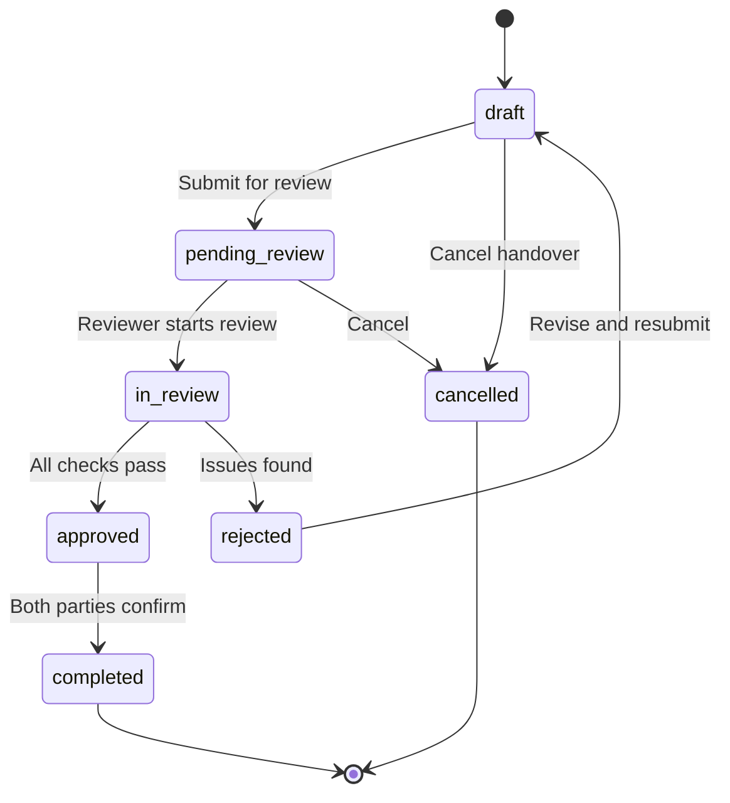

# Reference: Features F01-F04

> **SOT** for feature specifications: Projects, Handovers, Documents, Auth/RBAC. Extracted from PRD §6.

---

## F01: Projects Module (P0 — Core)

### Description
The projects module is the central entity of the system. It manages the complete project lifecycle through a 10-stage state machine, from initiation to completion.

### Functional Requirements

| ID | Requirement | Priority |
|----|-------------|----------|
| F01-01 | Create new project with name, description, category, priority | Must-Have |
| F01-02 | Auto-generate project code (PRJ-001, PRJ-002...) | Must-Have |
| F01-03 | Auto-generate URL slug from project name | Must-Have |
| F01-04 | Assign owner and team lead | Must-Have |
| F01-05 | Associate project with department | Should-Have |
| F01-06 | Set project timeline (start date, target end date) | Must-Have |
| F01-07 | Set project budget (allocated, currency) | Should-Have |
| F01-08 | Track budget spent vs allocated | Should-Have |
| F01-09 | 10-stage state machine with controlled transitions | Must-Have |
| F01-10 | Role-based transition authorization | Must-Have |
| F01-11 | Project health status tracking (on_track, at_risk, delayed, blocked) | Must-Have |
| F01-12 | Progress percentage tracking (0-100%) | Must-Have |
| F01-13 | Project member management (add, remove, change role) | Must-Have |
| F01-14 | Tag-based project categorization | Could-Have |
| F01-15 | Project archive (soft delete) | Must-Have |
| F01-16 | List projects with pagination, filtering, sorting | Must-Have |
| F01-17 | Search projects by name, code, description | Must-Have |
| F01-18 | Filter by stage, priority, health status, department, owner | Must-Have |
| F01-19 | Project detail view with timeline visualization | Must-Have |
| F01-20 | Stage transition history (audit trail) | Must-Have |

### UI Screens

| Screen | Route | Components |
|--------|-------|-----------|
| Project List | `/dashboard/projects` | ProjectList, ProjectFilters, ProjectCard |
| Project Detail | `/dashboard/projects/[slug]` | ProjectDetail, ProjectStageTimeline, ProjectStatusBadge |
| Create Project | `/dashboard/projects/new` | ProjectForm |
| Edit Project | `/dashboard/projects/[slug]/edit` | ProjectForm |
| Project Members | `/dashboard/projects/[slug]/members` | MemberList, MemberInvite |

### Acceptance Criteria
- [ ] Projects can be created with all required fields
- [ ] Project code auto-generates uniquely (PRJ-001 format)
- [ ] State machine enforces all 15 allowed transitions
- [ ] Unauthorized role transitions are blocked with clear error
- [ ] Each transition creates an audit log entry
- [ ] Project list supports pagination (20 per page default)
- [ ] Filters work independently and in combination
- [ ] Soft delete archives without data loss
- [ ] Vietnamese labels render correctly for all stages, priorities, and statuses

---

## F02: Handovers Module (P0 — Core)

### Description
Handovers manage the formal transfer of project responsibility between team members or departments. Each handover includes a verification checklist that must be completed before the handover is finalized.

### Functional Requirements

| ID | Requirement | Priority |
|----|-------------|----------|
| F02-01 | Create handover linked to a project | Must-Have |
| F02-02 | Specify handover type (project_transfer, stage_transition, team_change, department_transfer, role_change) | Must-Have |
| F02-03 | Specify from/to user and optionally from/to department | Must-Have |
| F02-04 | Handover status workflow (draft → pending_review → in_review → approved/rejected → completed) | Must-Have |
| F02-05 | Auto-generate checklist from templates based on handover type | Must-Have |
| F02-06 | Manual checklist item creation | Should-Have |
| F02-07 | Checklist item completion tracking with evidence | Must-Have |
| F02-08 | Checklist item categories (documentation, access_transfer, knowledge_transfer, tool_setup, review, signoff) | Must-Have |
| F02-09 | Required vs recommended vs optional checklist items | Should-Have |
| F02-10 | Approval workflow (requires designated approver) | Must-Have |
| F02-11 | Rejection with reason documentation | Must-Have |
| F02-12 | Due date tracking with overdue notifications | Should-Have |
| F02-13 | Attach documents to handover | Must-Have |
| F02-14 | Link handover to project stage transitions | Must-Have |
| F02-15 | Handover history per project | Must-Have |

### Handover Status Workflow



### Handover Checklist Item Structure

```typescript
interface ChecklistItem {
  id: string;
  title: string;
  description?: string;
  category: 'documentation' | 'access_transfer' | 'knowledge_transfer' |
             'tool_setup' | 'review' | 'signoff' | 'other';
  priority: 'required' | 'recommended' | 'optional';
  is_completed: boolean;
  completed_by?: string;    // User ID
  completed_at?: string;    // ISO timestamp
  requires_evidence: boolean;
  evidence_url?: string;
  evidence_notes?: string;
  sort_order: number;
}
```

### UI Screens

| Screen | Route | Components |
|--------|-------|-----------|
| Handover List (per project) | `/dashboard/projects/[slug]/handovers` | HandoverList, HandoverFilters |
| Handover Detail | `/dashboard/handovers/[id]` | HandoverDetail, ChecklistView, HandoverTimeline |
| Create Handover | `/dashboard/projects/[slug]/handovers/new` | HandoverForm, ChecklistEditor |
| All Handovers (user) | `/dashboard/handovers` | HandoverList (filtered to current user) |

### Acceptance Criteria
- [ ] Handovers link to exactly one project
- [ ] Checklist auto-populates from templates based on handover type
- [ ] All required checklist items must be completed before approval
- [ ] Rejected handovers return to draft with documented reason
- [ ] Completed handovers are immutable (no further edits)
- [ ] Handover notifications sent to both parties
- [ ] Evidence can be attached to checklist items (URL or notes)
- [ ] Overdue handovers appear in notifications

---

## F03: Documents Module (P1 — Essential)

### Description
Documents module manages all project-related documentation with version control. Documents can be associated with projects and/or handovers.

### Functional Requirements

| ID | Requirement | Priority |
|----|-------------|----------|
| F03-01 | Create document with title, type, content | Must-Have |
| F03-02 | Associate document with project and/or handover | Must-Have |
| F03-03 | Document types: requirement, design, technical, test_plan, user_guide, handover, report, meeting_notes, other | Must-Have |
| F03-04 | Document status workflow (draft → review → approved → archived) | Must-Have |
| F03-05 | Version control with change summary | Must-Have |
| F03-06 | View version history and diff | Should-Have |
| F03-07 | Restore previous version | Could-Have |
| F03-08 | File upload support (with size limit) | Should-Have |
| F03-09 | Text-based document editing (Markdown) | Must-Have |
| F03-10 | Document tagging | Could-Have |
| F03-11 | Document search (by title, content) | Must-Have |
| F03-12 | Document list with filtering by type, status, project | Must-Have |
| F03-13 | Soft delete (move to trash, recoverable) | Must-Have |
| F03-14 | Document sharing/permissions | Should-Have |

### Document Status Workflow

```
draft → review → approved → archived
                ↓
             obsolete (can be marked from any state)
```

### UI Screens

| Screen | Route | Components |
|--------|-------|-----------|
| Document List (project) | `/dashboard/projects/[slug]/documents` | DocumentList, DocumentFilters |
| Document Detail | `/dashboard/documents/[id]` | DocumentViewer, VersionHistory |
| Create Document | `/dashboard/documents/new` | DocumentEditor |
| Edit Document | `/dashboard/documents/[id]/edit` | DocumentEditor |
| All Documents | `/dashboard/documents` | DocumentList (global) |

### Acceptance Criteria
- [ ] Documents store both text content and file references
- [ ] Each edit creates a new version automatically
- [ ] Version history shows change summary and author
- [ ] Documents can be filtered by type, status, and project
- [ ] Search works across title and content
- [ ] Soft delete preserves document for recovery
- [ ] Documents linked to completed handovers are read-only

---

## F04: Auth & RBAC Module (P0 — Foundation)

### Description
Authentication via Supabase Auth with role-based access control. Five predefined roles with granular permissions per module.

### Functional Requirements

| ID | Requirement | Priority |
|----|-------------|----------|
| F04-01 | Email/password authentication (signup, login, logout) | Must-Have |
| F04-02 | OAuth callback handling | Should-Have |
| F04-03 | Edge middleware for auth checks | Must-Have |
| F04-04 | Server-side auth with `getUser()` (not `getSession()`) | Must-Have |
| F04-05 | 5 predefined roles: admin, manager, lead, member, viewer | Must-Have |
| F04-06 | Role-based route protection | Must-Have |
| F04-07 | Role-based UI element visibility | Must-Have |
| F04-08 | Permission matrix per module (see ref-rbac-matrix.md) | Must-Have |
| F04-09 | RLS policies on all user-scoped tables | Must-Have |
| F04-10 | User profile management | Must-Have |
| F04-11 | User invitation system (invite by email) | Should-Have |
| F04-12 | Password reset flow | Must-Have |
| F04-13 | Session management | Must-Have |
| F04-14 | Rate limiting on auth endpoints | Must-Have |
| F04-15 | Audit log for all auth events (login, logout, login_failed) | Must-Have |

### Auth Flow (Detailed)

```
1. User visits /login
2. LoginForm component renders (client)
3. User submits email + password
4. supabase.auth.signInWithPassword() called
5. On success: redirect to /dashboard
6. On failure: display error message

--- For every protected route ---
7. middleware.ts (Edge Runtime) intercepts request
8. Calls supabase.auth.getUser() to validate session
9. If no valid session: redirect to /login
10. If valid session: proceed to route
11. Server Components use getUser() for auth context
12. RLS policies enforce data access at database level
```

### Security Non-Negotiables

| Rule | Implementation |
|------|---------------|
| Server auth method | `getUser()` always — NEVER `getSession()` (forgeable) |
| Client creation | `createServerClient` in Server Components and API routes |
| Token storage | Server-side cookies only — NEVER localStorage |
| RLS default | Every user-scoped table has RLS — not optional |
| Rate limiting | Rate limiting middleware on `/login` and `/signup` |
| Edge middleware | Auth checks at the edge (50ms vs 150-400ms) |
| Audit trail | Every auth event logged (login, logout, failed login) |

### UI Screens

| Screen | Route | Components |
|--------|-------|-----------|
| Login | `/login` | LoginForm |
| Signup | `/signup` | SignupForm |
| Forgot Password | `/forgot-password` | ForgotPasswordForm |
| Reset Password | `/reset-password` | ResetPasswordForm |
| User Profile | `/dashboard/settings` | ProfileForm, PasswordChangeForm |
| User Management (admin) | `/dashboard/settings/users` | UserList, UserInviteForm, RoleAssignment |

### Acceptance Criteria
- [ ] Login/signup/logout work end-to-end
- [ ] Edge middleware blocks unauthenticated access to `/dashboard/*`
- [ ] Server Components use `getUser()` (not `getSession()`)
- [ ] All 5 roles exist with correct permission sets
- [ ] RLS policies enforced at database level
- [ ] Rate limiting active on auth endpoints
- [ ] Auth events appear in audit log
- [ ] Password reset flow works via email
- [ ] Invitation system allows admin to invite new users

---

*Source: PRD v1.0 §6, §10.3, §11.5*
