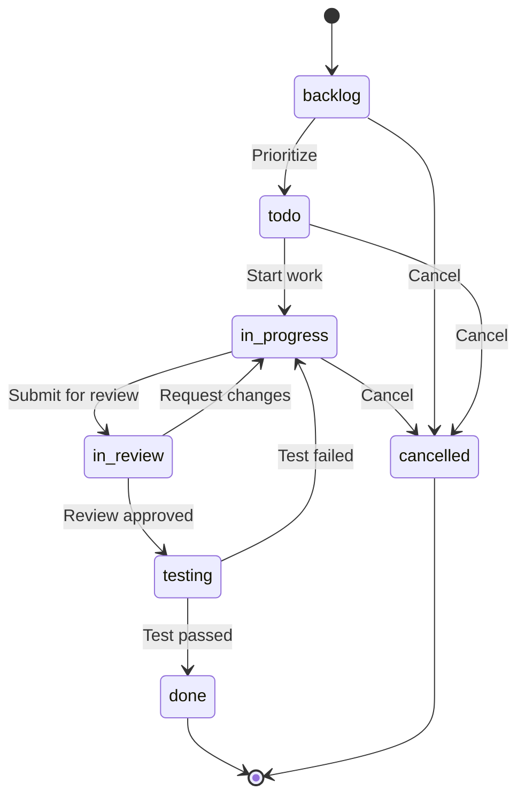

# Reference: Features F05-F10

> **SOT** for feature specifications: Tasks, Notifications, Audit, Finance, Reports, Compliance. Extracted from PRD §6.

---

## F05: Tasks Module (P0 — Core)

### Description
Task management within projects. Tasks are the atomic work units that team members execute. Tasks support hierarchical structure (parent/subtasks), dependencies, and assignment.

### Functional Requirements

| ID | Requirement | Priority |
|----|-------------|----------|
| F05-01 | Create task within a project | Must-Have |
| F05-02 | Auto-generate task code (TSK-001 format) | Must-Have |
| F05-03 | Task types: feature, bug, improvement, documentation, testing, deployment, research, other | Must-Have |
| F05-04 | Task priority: critical, high, medium, low | Must-Have |
| F05-05 | Task status workflow: backlog → todo → in_progress → in_review → testing → done | Must-Have |
| F05-06 | Assign task to user | Must-Have |
| F05-07 | Task reporter (who created it) | Must-Have |
| F05-08 | Associate task with project stage | Should-Have |
| F05-09 | Due date and time tracking (estimated vs actual hours) | Must-Have |
| F05-10 | Parent/subtask hierarchy | Should-Have |
| F05-11 | Task dependencies (depends_on) | Should-Have |
| F05-12 | Acceptance criteria per task | Must-Have |
| F05-13 | Task comments (threaded) | Must-Have |
| F05-14 | Task tagging | Could-Have |
| F05-15 | List tasks with pagination, filtering, sorting | Must-Have |
| F05-16 | Filter by status, priority, assignee, stage, type | Must-Have |
| F05-17 | Kanban board view (by status) | Should-Have |
| F05-18 | Task list view (table) | Must-Have |
| F05-19 | Bulk status update | Could-Have |
| F05-20 | Cancel task (with reason) | Must-Have |

### Task Status Workflow

### UI Screens

| Screen | Route | Components |
|--------|-------|-----------|
| Task List (project) | `/dashboard/projects/[slug]/tasks` | TaskList, TaskFilters, TaskKanban |
| Task Detail | `/dashboard/tasks/[id]` | TaskDetail, CommentThread, SubtaskList |
| Create Task | `/dashboard/projects/[slug]/tasks/new` | TaskForm |
| My Tasks | `/dashboard/tasks` | TaskList (filtered to current user) |

### Acceptance Criteria
- [ ] Tasks belong to exactly one project
- [ ] Task code auto-generates per project (TSK-001)
- [ ] Status transitions follow the workflow diagram
- [ ] Assignee receives notification on assignment
- [ ] Comments support threading (replies to comments)
- [ ] Task list supports both table and kanban views
- [ ] Filters work across all task fields
- [ ] Subtasks display as nested items

---

## F06: Notifications Module (P1 — Essential)

### Description
In-app and email notifications for system events. Users receive notifications for task assignments, handover actions, project stage changes, and more.

### Functional Requirements

| ID | Requirement | Priority |
|----|-------------|----------|
| F06-01 | In-app notification delivery | Must-Have |
| F06-02 | Notification bell with unread count | Must-Have |
| F06-03 | Mark as read (individual and bulk) | Must-Have |
| F06-04 | Notification list with pagination | Must-Have |
| F06-05 | Notification types (14 types — see schema) | Must-Have |
| F06-06 | Priority levels: urgent, high, normal, low | Should-Have |
| F06-07 | Click-through to relevant entity | Must-Have |
| F06-08 | Email notification for urgent/high priority | Should-Have |
| F06-09 | Notification preferences (per type enable/disable) | Should-Have |
| F06-10 | Auto-expire old notifications (30 days) | Could-Have |
| F06-11 | Real-time notification delivery (WebSocket/SSE) | Could-Have |

### Notification Triggers

| Event | Notification Type | Recipients | Priority |
|-------|------------------|-----------|----------|
| Task assigned | `task_assigned` | Assignee | normal |
| Task status changed | `task_status_changed` | Reporter, project lead | normal |
| New task comment | `task_comment` | Task assignee, mentioned users | normal |
| Handover initiated | `handover_initiated` | To-user, project lead | high |
| Handover approved | `handover_approved` | From-user, to-user | normal |
| Handover rejected | `handover_rejected` | From-user | high |
| Project stage changed | `project_stage_changed` | All project members | normal |
| Document shared | `document_shared` | Shared-with users | normal |
| Document approved | `document_approved` | Document author | normal |
| User mentioned | `mention` | Mentioned user | normal |
| Deadline in 24h | `deadline_approaching` | Assignee, project lead | high |
| Deadline overdue | `deadline_overdue` | Assignee, project lead, manager | urgent |
| System alert | `system_alert` | Admins | urgent |
| Report generated | `report_generated` | Requester | low |

### UI Components

| Component | Location | Behavior |
|-----------|----------|----------|
| NotificationBell | Header (global) | Shows unread count, dropdown with recent 5 |
| NotificationList | `/dashboard/notifications` | Full list, pagination, mark as read |
| NotificationItem | Inside list/dropdown | Type icon, message, time, click-through |
| NotificationPreferences | `/dashboard/settings/notifications` | Toggle per notification type |

### Acceptance Criteria
- [ ] Notifications appear within 5 seconds of trigger event
- [ ] Unread count updates in real-time (or on page navigation)
- [ ] Click-through navigates to the relevant entity
- [ ] Bulk mark as read works
- [ ] Notification preferences respected (disabled types not sent)
- [ ] Vietnamese labels for all notification types

---

## F07: Audit Log Module (P1 — Essential)

### Description
Immutable audit trail for all significant system actions. Audit logs cannot be edited or deleted.

### Functional Requirements

| ID | Requirement | Priority |
|----|-------------|----------|
| F07-01 | Log all CRUD operations on core entities | Must-Have |
| F07-02 | Log auth events (login, logout, failed login) | Must-Have |
| F07-03 | Log stage transitions | Must-Have |
| F07-04 | Log handover actions | Must-Have |
| F07-05 | Log permission changes | Must-Have |
| F07-06 | Log billing/settings changes | Should-Have |
| F07-07 | Capture before/after state (old_values, new_values) | Must-Have |
| F07-08 | Capture actor, IP address, user agent | Must-Have |
| F07-09 | Severity levels: info, warning, critical | Must-Have |
| F07-10 | Filter audit logs by entity, action, user, date range, severity | Must-Have |
| F07-11 | Export audit logs (CSV) | Should-Have |
| F07-12 | Audit log immutability (no UPDATE/DELETE) | Must-Have |

### UI Screens

| Screen | Route | Access |
|--------|-------|--------|
| Audit Log List | `/dashboard/audit-log` | Admin, Manager |
| Entity Audit Trail | `/dashboard/projects/[slug]/audit` | Admin, Manager, Lead |

### Acceptance Criteria
- [ ] Every CRUD operation generates an audit log entry
- [ ] old_values and new_values capture the actual changes
- [ ] Audit logs are immutable — no UPDATE/DELETE APIs exist
- [ ] Admin and manager roles can view audit logs
- [ ] Users can view their own audit log entries
- [ ] Filters work across all audit log fields
- [ ] Vietnamese labels for all action types

---

## F08: Financial Records Module (P2 — Enhanced)

### Description
Basic financial tracking per project. Tracks budget allocation, expenses, and financial status.

### Functional Requirements

| ID | Requirement | Priority |
|----|-------------|----------|
| F08-01 | Record financial transactions per project | Must-Have |
| F08-02 | Transaction types: budget_allocation, expense, invoice, payment, refund, adjustment | Must-Have |
| F08-03 | Transaction categories: labor, software, hardware, infrastructure, consulting, training, travel, other | Must-Have |
| F08-04 | Amount tracking in smallest currency unit (cents) | Must-Have |
| F08-05 | Transaction approval workflow | Should-Have |
| F08-06 | Budget vs actual comparison per project | Must-Have |
| F08-07 | Financial summary per project | Must-Have |
| F08-08 | Attachment support (receipts, invoices) | Should-Have |
| F08-09 | Filter by project, type, category, status, date range | Must-Have |
| F08-10 | Export financial records (CSV) | Should-Have |

### UI Screens

| Screen | Route | Access |
|--------|-------|--------|
| Project Financials | `/dashboard/projects/[slug]/financials` | Admin, Manager, Lead |
| Financial Overview | `/dashboard/financials` | Admin, Manager |
| Create Transaction | `/dashboard/projects/[slug]/financials/new` | Admin, Manager |

### Acceptance Criteria
- [ ] Financial records link to exactly one project
- [ ] Budget vs actual displayed on project detail
- [ ] Only authorized roles can create/modify financial records
- [ ] Amounts stored as integers (cents) to avoid floating point issues
- [ ] Audit log entries for all financial changes

---

## F09: Reports Module (P2 — Enhanced)

### Description
Reporting dashboard with project health summaries, task completion rates, handover statistics, and financial overviews.

### Functional Requirements

| ID | Requirement | Priority |
|----|-------------|----------|
| F09-01 | Project overview dashboard (count by stage, health status distribution) | Must-Have |
| F09-02 | Task completion rate per project and overall | Must-Have |
| F09-03 | Handover completion rate and average duration | Should-Have |
| F09-04 | Financial summary (budget vs actual across projects) | Should-Have |
| F09-05 | Team workload distribution (tasks per assignee) | Should-Have |
| F09-06 | Overdue items summary (tasks + handovers) | Must-Have |
| F09-07 | Activity timeline (recent actions across all projects) | Should-Have |
| F09-08 | Export reports (PDF, CSV) | Could-Have |
| F09-09 | Date range selection for all reports | Must-Have |
| F09-10 | Department-level filtering | Should-Have |

### UI Screens

| Screen | Route | Access |
|--------|-------|--------|
| Dashboard Home | `/dashboard` | All authenticated users |
| Reports Overview | `/dashboard/reports` | Admin, Manager |
| Project Report | `/dashboard/projects/[slug]/report` | Admin, Manager, Lead |

### Key Metrics Displayed

| Metric | Vietnamese Label | Calculation |
|--------|-----------------|-------------|
| Total Projects | Tổng dự án | COUNT(projects) WHERE NOT archived |
| Active Projects | Dự án đang hoạt động | COUNT WHERE stage NOT IN (completed, initiation) |
| On Track | Đúng tiến độ | COUNT WHERE health = 'on_track' |
| At Risk | Có rủi ro | COUNT WHERE health = 'at_risk' |
| Delayed | Trễ tiến độ | COUNT WHERE health = 'delayed' |
| Blocked | Bị chặn | COUNT WHERE health = 'blocked' |
| Task Completion Rate | Tỷ lệ hoàn thành | done_tasks / total_tasks * 100 |
| Overdue Tasks | Công việc quá hạn | COUNT WHERE due_date < NOW AND status NOT IN (done, cancelled) |
| Open Handovers | Bàn giao đang xử lý | COUNT WHERE status NOT IN (completed, cancelled) |
| Budget Utilization | Tỷ lệ sử dụng ngân sách | budget_spent / budget_allocated * 100 |

### Acceptance Criteria
- [ ] Dashboard loads within 2 seconds
- [ ] All metrics calculate correctly from real data
- [ ] Date range filter applies to all reports
- [ ] Vietnamese labels for all metrics
- [ ] Reports are role-appropriate (members see own, managers see department)

---

## F10: Compliance Module (P2 — Enhanced)

### Description
Track compliance status against frameworks (ISO 27001, SOC2, GDPR, etc.) per project. Provides evidence collection and audit-readiness.

### Functional Requirements

| ID | Requirement | Priority |
|----|-------------|----------|
| F10-01 | Track compliance controls per framework | Must-Have |
| F10-02 | Supported frameworks: ISO 27001, SOC2, GDPR, HIPAA, PCI-DSS, NIST, Custom | Must-Have |
| F10-03 | Control status: not_started, in_progress, implemented, verified, non_compliant, not_applicable | Must-Have |
| F10-04 | Evidence collection (description, URL, notes) | Must-Have |
| F10-05 | Risk level assessment per control | Should-Have |
| F10-06 | Remediation plan with deadline | Should-Have |
| F10-07 | Review date scheduling | Should-Have |
| F10-08 | Compliance overview per project | Must-Have |
| F10-09 | Compliance summary across all projects | Should-Have |
| F10-10 | Filter by framework, status, risk level | Must-Have |
| F10-11 | Export compliance report (PDF) | Could-Have |
| F10-12 | Assign responsible person per control | Must-Have |

### UI Screens

| Screen | Route | Access |
|--------|-------|--------|
| Project Compliance | `/dashboard/projects/[slug]/compliance` | Admin, Manager, Lead |
| Compliance Overview | `/dashboard/compliance` | Admin, Manager |
| Control Detail | `/dashboard/compliance/[id]` | Admin, Manager, Lead |

### Compliance Status Colors

| Status | Vietnamese Label | Color |
|--------|-----------------|-------|
| not_started | Chưa bắt đầu | gray |
| in_progress | Đang thực hiện | blue |
| implemented | Đã triển khai | yellow |
| verified | Đã xác minh | green |
| non_compliant | Không tuân thủ | red |
| not_applicable | Không áp dụng | gray (lighter) |

### Acceptance Criteria
- [ ] Compliance records link to projects
- [ ] All 7 frameworks supported
- [ ] Evidence can be attached (URL + notes)
- [ ] Risk levels displayed with color coding
- [ ] Compliance summary shows percentage by framework
- [ ] Overdue reviews trigger notifications
- [ ] Vietnamese labels for all statuses and frameworks

---

## Cross-Feature Integration Points

| From Module | To Module | Integration |
|-------------|-----------|-------------|
| F01 (Projects) | F05 (Tasks) | Tasks belong to projects |
| F01 (Projects) | F02 (Handovers) | Handovers linked to projects, triggered by stage transitions |
| F01 (Projects) | F03 (Documents) | Documents associated with projects |
| F01 (Projects) | F08 (Finance) | Financial records per project |
| F01 (Projects) | F10 (Compliance) | Compliance tracked per project |
| F02 (Handovers) | F03 (Documents) | Documents attached to handovers |
| F05 (Tasks) | F06 (Notifications) | Task actions trigger notifications |
| F02 (Handovers) | F06 (Notifications) | Handover actions trigger notifications |
| All modules | F07 (Audit) | All CRUD operations logged |
| F01, F05, F08 | F09 (Reports) | Reports aggregate data from multiple modules |

---

*Source: PRD v1.0 §6*
