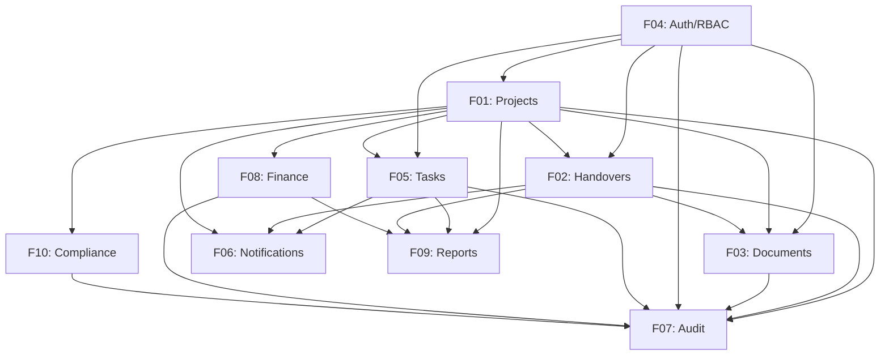

# Reference: Integration Points Between Modules

> **SOT** for cross-module integration patterns, data flows, and event-driven connections.

---

## 1. Module Dependency Graph



---

## 2. Integration Point Matrix

| From Module | To Module | Trigger Event | Data Flow | Integration Type |
|-------------|-----------|---------------|-----------|-----------------|
| F01 → F05 | Projects → Tasks | Project created | project_id | Foreign key |
| F01 → F02 | Projects → Handovers | Stage transition to 'handover' | project_id, from_stage, to_stage | Event-driven |
| F01 → F03 | Projects → Documents | Project created | project_id | Foreign key |
| F01 → F06 | Projects → Notifications | Stage change | project members | Event-driven |
| F01 → F07 | Projects → Audit | Any CRUD operation | entity details + old/new values | Event-driven |
| F01 → F08 | Projects → Finance | Project created with budget | project_id, budget | Foreign key |
| F01 → F09 | Projects → Reports | Data aggregation | project stats | Query-based |
| F01 → F10 | Projects → Compliance | Project created | project_id | Foreign key |
| F02 → F03 | Handovers → Documents | Document attached to handover | handover_id, document_id | Foreign key |
| F02 → F06 | Handovers → Notifications | Status change | from_user, to_user | Event-driven |
| F02 → F07 | Handovers → Audit | Any status change | entity details + old/new | Event-driven |
| F03 → F06 | Documents → Notifications | Document shared/approved | recipient users | Event-driven |
| F03 → F07 | Documents → Audit | Any CRUD operation | entity details | Event-driven |
| F04 → F07 | Auth → Audit | Login/logout/failed | user details + IP | Event-driven |
| F05 → F06 | Tasks → Notifications | Assigned, status change, comment | assignee, watchers | Event-driven |
| F05 → F07 | Tasks → Audit | Any CRUD operation | entity details | Event-driven |
| F05 → F09 | Tasks → Reports | Data aggregation | completion rates | Query-based |
| F08 → F07 | Finance → Audit | Any financial change | amount, type, approval | Event-driven |
| F08 → F09 | Finance → Reports | Data aggregation | budget vs actual | Query-based |
| F10 → F07 | Compliance → Audit | Status change | control details | Event-driven |

---

## 3. Event-Driven Integration Details

### 3.1 Project Stage Change Event

**Trigger**: `transitionStage()` action in F01
**Subscribers**:

| Subscriber | Action |
|-----------|--------|
| F06 (Notifications) | Send notification to all project members |
| F07 (Audit) | Create audit log with stage_change action |
| F02 (Handovers) | If transitioning to 'handover' stage, auto-create handover record from template |
| F09 (Reports) | Invalidate cached project stats |

**Event Payload**:
```typescript
interface ProjectStageChangedEvent {
  project_id: string;
  project_name: string;
  from_stage: ProjectStage;
  to_stage: ProjectStage;
  triggered_by: string;       // user ID
  reason?: string;
  timestamp: string;          // ISO 8601
}
```

### 3.2 Task Assignment Event

**Trigger**: `createTask()` or `updateTask()` with assignee change in F05
**Subscribers**:

| Subscriber | Action |
|-----------|--------|
| F06 (Notifications) | Send 'task_assigned' notification to assignee |
| F07 (Audit) | Create audit log with 'assign' action |

**Event Payload**:
```typescript
interface TaskAssignedEvent {
  task_id: string;
  task_title: string;
  project_id: string;
  assignee_id: string;
  assigned_by: string;        // user ID
  previous_assignee_id?: string;
  timestamp: string;
}
```

### 3.3 Task Status Change Event

**Trigger**: `updateTask()` with status change in F05
**Subscribers**:

| Subscriber | Action |
|-----------|--------|
| F06 (Notifications) | Send 'task_status_changed' to reporter and project lead |
| F07 (Audit) | Create audit log with 'status_change' action |
| F01 (Projects) | Recalculate project progress_percentage |

**Event Payload**:
```typescript
interface TaskStatusChangedEvent {
  task_id: string;
  task_title: string;
  project_id: string;
  from_status: TaskStatus;
  to_status: TaskStatus;
  changed_by: string;
  timestamp: string;
}
```

### 3.4 Handover Status Change Event

**Trigger**: Any status transition in F02
**Subscribers**:

| Subscriber | Action |
|-----------|--------|
| F06 (Notifications) | Send appropriate notification type |
| F07 (Audit) | Create audit log entry |
| F01 (Projects) | If handover completed AND project in 'handover' stage, allow transition to 'completed' |

**Event Payload**:
```typescript
interface HandoverStatusChangedEvent {
  handover_id: string;
  handover_title: string;
  project_id: string;
  from_status: HandoverStatus;
  to_status: HandoverStatus;
  from_user_id: string;
  to_user_id: string;
  changed_by: string;
  timestamp: string;
}
```

### 3.5 Auth Event

**Trigger**: Login, logout, failed login in F04
**Subscribers**:

| Subscriber | Action |
|-----------|--------|
| F07 (Audit) | Create audit log with auth action type |
| F06 (Notifications) | For failed_login: if 3+ failures, send security alert to admin |

**Event Payload**:
```typescript
interface AuthEvent {
  user_id?: string;           // null for failed login with unknown user
  user_email: string;
  action: 'login' | 'logout' | 'login_failed';
  ip_address: string;
  user_agent: string;
  timestamp: string;
  failure_reason?: string;
}
```

### 3.6 Deadline Events

**Trigger**: Cron job / scheduled check
**Subscribers**:

| Subscriber | Action |
|-----------|--------|
| F06 (Notifications) | Send 'deadline_approaching' (24h before) or 'deadline_overdue' |

**Checked Entities**:
- Tasks with `due_date`
- Handovers with `due_date`
- Projects with `target_end_date`
- Compliance records with `remediation_deadline`

---

## 4. Query-Based Integrations (Reports)

### 4.1 Dashboard Metrics (F09)

| Metric | Source Module | Query |
|--------|-------------|-------|
| Projects by stage | F01 | `SELECT stage, COUNT(*) FROM projects GROUP BY stage` |
| Projects by health | F01 | `SELECT health_status, COUNT(*) FROM projects GROUP BY health_status` |
| Task completion rate | F05 | `SELECT status, COUNT(*) FROM tasks WHERE project_id = ? GROUP BY status` |
| Overdue tasks | F05 | `SELECT COUNT(*) FROM tasks WHERE due_date < NOW() AND status NOT IN ('done', 'cancelled')` |
| Open handovers | F02 | `SELECT COUNT(*) FROM handovers WHERE status NOT IN ('completed', 'cancelled')` |
| Budget utilization | F08 | `SELECT SUM(budget_spent) / SUM(budget_allocated) FROM projects` |
| Active users | F04 | `SELECT COUNT(*) FROM users WHERE last_login_at > NOW() - INTERVAL '30 days'` |

### 4.2 Project Report (F09)

| Section | Source | Query Pattern |
|---------|--------|--------------|
| Stage history | F07 | `SELECT * FROM audit_logs WHERE entity_type = 'project' AND action = 'stage_change'` |
| Task breakdown | F05 | `SELECT type, status, COUNT(*) FROM tasks WHERE project_id = ? GROUP BY type, status` |
| Handover history | F02 | `SELECT * FROM handovers WHERE project_id = ? ORDER BY created_at` |
| Financial summary | F08 | `SELECT type, SUM(amount) FROM financial_records WHERE project_id = ? GROUP BY type` |
| Compliance status | F10 | `SELECT framework, status, COUNT(*) FROM compliance_records WHERE project_id = ? GROUP BY framework, status` |

---

## 5. Shared Infrastructure

### 5.1 Audit Log Helper

All modules use a shared function to create audit logs:

```typescript
// Shared across all modules
export async function createAuditLog(params: {
  action: AuditAction;
  entity_type: EntityType;
  entity_id?: string;
  entity_name?: string;
  project_id?: string;
  old_values?: Record<string, unknown>;
  new_values?: Record<string, unknown>;
  description?: string;
  severity?: 'info' | 'warning' | 'critical';
}): Promise<void> {
  const user = await getAuthUser();
  await db.insert(audit_logs).values({
    user_id: user?.id,
    user_email: user?.email,
    user_role: user?.role,
    ...params,
    ip_address: getClientIP(),
    user_agent: getUserAgent(),
    request_id: getRequestId(),
    created_at: new Date(),
  });
}
```

### 5.2 Notification Helper

```typescript
export async function createNotification(params: {
  user_id: string;
  title: string;
  message: string;
  type: NotificationType;
  priority?: NotificationPriority;
  project_id?: string;
  task_id?: string;
  handover_id?: string;
  document_id?: string;
  actor_id?: string;
  action_url?: string;
}): Promise<void> {
  await db.insert(notifications).values({
    ...params,
    is_read: false,
    created_at: new Date(),
  });

  // If urgent/high priority, also queue email notification
  if (params.priority === 'urgent' || params.priority === 'high') {
    await queueEmailNotification(params);
  }
}
```

### 5.3 Permission Check Helper

```typescript
export async function requirePermission(
  module: string,
  action: string,
  context?: { projectId?: string; resourceOwnerId?: string }
): Promise<void> {
  const user = await getAuthUser();
  if (!user) throw new AuthenticationError('Not authenticated');

  const role = await getUserRole(user.id);
  const permissions = role.permissions[module];

  if (!permissions || !permissions[action]) {
    throw new AuthorizationError(
      `Insufficient permissions: ${module}.${action}`
    );
  }

  // Additional ownership/project membership checks
  if (context?.projectId) {
    await requireProjectMembership(user.id, context.projectId);
  }
}
```

---

## 6. Data Consistency Rules

| Rule | Enforcement |
|------|-------------|
| Task can only exist within a project | Foreign key constraint |
| Handover parties must be real users | Foreign key constraint |
| Financial records must reference existing projects | Foreign key constraint |
| Soft-deleted entities excluded from queries by default | Query-level WHERE clause |
| Audit logs are immutable | No UPDATE/DELETE RLS policies |
| Completed handovers are read-only | Application-level check |
| Project stage transitions must follow state machine | Application-level validation |
| Task assignee must be a project member | Application-level check |

---

*Source: PRD v1.0 §6, §7, §10*
