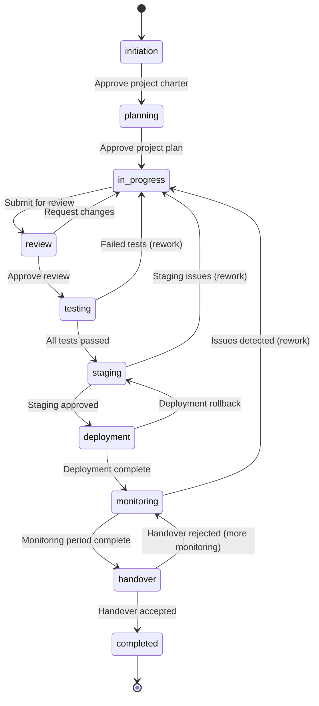

# Reference: Project Stage State Machine

> **SOT** for project lifecycle stages, transitions, and Vietnamese labels. Extracted from PRD §6.

---

## 1. Ten Stages

The project lifecycle has exactly 10 stages. Projects move forward through these stages, with controlled backward transitions for rework scenarios.

| # | Stage Key | English Name | Vietnamese Label | Description |
|---|-----------|-------------|-----------------|-------------|
| 1 | `initiation` | Initiation | Khởi tạo | Project setup, stakeholder identification, initial requirements |
| 2 | `planning` | Planning | Lập kế hoạch | Detailed planning, resource allocation, timeline definition |
| 3 | `in_progress` | In Progress | Đang thực hiện | Active development and implementation |
| 4 | `review` | Review | Đánh giá | Code review, design review, quality checks |
| 5 | `testing` | Testing | Kiểm thử | QA testing, integration testing, user acceptance testing |
| 6 | `staging` | Staging | Tiền triển khai | Pre-production environment validation |
| 7 | `deployment` | Deployment | Triển khai | Production deployment execution |
| 8 | `monitoring` | Monitoring | Giám sát | Post-deployment monitoring and stability verification |
| 9 | `handover` | Handover | Bàn giao | Formal project handover, knowledge transfer |
| 10 | `completed` | Completed | Hoàn thành | Project complete, archived |

---

## 2. Stage Transition Diagram



---

## 3. Allowed Transitions (Formal Specification)

```typescript
type ProjectStage =
  | 'initiation'
  | 'planning'
  | 'in_progress'
  | 'review'
  | 'testing'
  | 'staging'
  | 'deployment'
  | 'monitoring'
  | 'handover'
  | 'completed';

interface StageTransition {
  from: ProjectStage;
  to: ProjectStage;
  trigger: string;           // What causes the transition
  guard?: string;            // Condition that must be true
  required_role: string[];   // Who can trigger this transition
  creates_audit_log: boolean;
  creates_notification: boolean;
  requires_handover: boolean; // Does this transition require a handover record?
}

const ALLOWED_TRANSITIONS: StageTransition[] = [
  // Forward transitions
  {
    from: 'initiation',
    to: 'planning',
    trigger: 'approve_charter',
    guard: 'project has owner and at least one team member',
    required_role: ['admin', 'manager', 'lead'],
    creates_audit_log: true,
    creates_notification: true,
    requires_handover: false,
  },
  {
    from: 'planning',
    to: 'in_progress',
    trigger: 'approve_plan',
    guard: 'project has start_date and target_end_date and at least one task',
    required_role: ['admin', 'manager', 'lead'],
    creates_audit_log: true,
    creates_notification: true,
    requires_handover: false,
  },
  {
    from: 'in_progress',
    to: 'review',
    trigger: 'submit_for_review',
    guard: 'all critical and high priority tasks are done or in_review',
    required_role: ['admin', 'manager', 'lead', 'member'],
    creates_audit_log: true,
    creates_notification: true,
    requires_handover: false,
  },
  {
    from: 'review',
    to: 'testing',
    trigger: 'approve_review',
    guard: 'review checklist completed',
    required_role: ['admin', 'manager', 'lead'],
    creates_audit_log: true,
    creates_notification: true,
    requires_handover: false,
  },
  {
    from: 'testing',
    to: 'staging',
    trigger: 'tests_passed',
    guard: 'all test cases passed, no critical bugs open',
    required_role: ['admin', 'manager', 'lead'],
    creates_audit_log: true,
    creates_notification: true,
    requires_handover: false,
  },
  {
    from: 'staging',
    to: 'deployment',
    trigger: 'staging_approved',
    guard: 'staging environment validated, deployment checklist ready',
    required_role: ['admin', 'manager'],
    creates_audit_log: true,
    creates_notification: true,
    requires_handover: false,
  },
  {
    from: 'deployment',
    to: 'monitoring',
    trigger: 'deployment_complete',
    guard: 'deployment successful, health checks passing',
    required_role: ['admin', 'manager', 'lead'],
    creates_audit_log: true,
    creates_notification: true,
    requires_handover: false,
  },
  {
    from: 'monitoring',
    to: 'handover',
    trigger: 'monitoring_complete',
    guard: 'monitoring period elapsed (default 48h), no critical issues',
    required_role: ['admin', 'manager'],
    creates_audit_log: true,
    creates_notification: true,
    requires_handover: true,
  },
  {
    from: 'handover',
    to: 'completed',
    trigger: 'handover_accepted',
    guard: 'all handover checklist items completed, receiving party confirmed',
    required_role: ['admin', 'manager'],
    creates_audit_log: true,
    creates_notification: true,
    requires_handover: false,
  },

  // Backward transitions (rework)
  {
    from: 'review',
    to: 'in_progress',
    trigger: 'request_changes',
    guard: 'review comments documented',
    required_role: ['admin', 'manager', 'lead'],
    creates_audit_log: true,
    creates_notification: true,
    requires_handover: false,
  },
  {
    from: 'testing',
    to: 'in_progress',
    trigger: 'tests_failed',
    guard: 'failed test cases documented as tasks',
    required_role: ['admin', 'manager', 'lead'],
    creates_audit_log: true,
    creates_notification: true,
    requires_handover: false,
  },
  {
    from: 'staging',
    to: 'in_progress',
    trigger: 'staging_issues',
    guard: 'staging issues documented as tasks',
    required_role: ['admin', 'manager', 'lead'],
    creates_audit_log: true,
    creates_notification: true,
    requires_handover: false,
  },
  {
    from: 'deployment',
    to: 'staging',
    trigger: 'deployment_rollback',
    guard: 'rollback reason documented',
    required_role: ['admin', 'manager'],
    creates_audit_log: true,
    creates_notification: true,
    requires_handover: false,
  },
  {
    from: 'monitoring',
    to: 'in_progress',
    trigger: 'issues_detected',
    guard: 'production issues documented as tasks',
    required_role: ['admin', 'manager'],
    creates_audit_log: true,
    creates_notification: true,
    requires_handover: false,
  },
  {
    from: 'handover',
    to: 'monitoring',
    trigger: 'handover_rejected',
    guard: 'rejection reason documented',
    required_role: ['admin', 'manager'],
    creates_audit_log: true,
    creates_notification: true,
    requires_handover: false,
  },
];
```

---

## 4. Transition Matrix (Quick Reference)

| From \ To | init | plan | in_prog | review | test | stage | deploy | monitor | handover | complete |
|-----------|------|------|---------|--------|------|-------|--------|---------|----------|----------|
| **initiation** | - | YES | - | - | - | - | - | - | - | - |
| **planning** | - | - | YES | - | - | - | - | - | - | - |
| **in_progress** | - | - | - | YES | - | - | - | - | - | - |
| **review** | - | - | YES | - | YES | - | - | - | - | - |
| **testing** | - | - | YES | - | - | YES | - | - | - | - |
| **staging** | - | - | YES | - | - | - | YES | - | - | - |
| **deployment** | - | - | - | - | - | YES | - | YES | - | - |
| **monitoring** | - | - | YES | - | - | - | - | - | YES | - |
| **handover** | - | - | - | - | - | - | - | YES | - | YES |
| **completed** | - | - | - | - | - | - | - | - | - | - |

- **Forward**: 9 transitions (left-to-right in the lifecycle)
- **Backward**: 6 transitions (rework loops back to `in_progress`, `staging`, or `monitoring`)
- **Terminal**: `completed` has no outgoing transitions

---

## 5. Stage Colors & Icons (UI)

| Stage | Color (Tailwind) | Badge Variant | Icon |
|-------|-----------------|---------------|------|
| `initiation` | `blue-100/blue-800` | outline | FileText |
| `planning` | `purple-100/purple-800` | outline | Calendar |
| `in_progress` | `yellow-100/yellow-800` | default | Loader |
| `review` | `orange-100/orange-800` | default | Eye |
| `testing` | `cyan-100/cyan-800` | default | TestTube |
| `staging` | `indigo-100/indigo-800` | default | Server |
| `deployment` | `emerald-100/emerald-800` | default | Rocket |
| `monitoring` | `teal-100/teal-800` | default | Activity |
| `handover` | `amber-100/amber-800` | default | ArrowRightLeft |
| `completed` | `green-100/green-800` | success | CheckCircle |

---

## 6. Vietnamese Stage Labels (Complete Map)

```typescript
export const STAGE_LABELS_VI: Record<ProjectStage, string> = {
  initiation: 'Khởi tạo',
  planning: 'Lập kế hoạch',
  in_progress: 'Đang thực hiện',
  review: 'Đánh giá',
  testing: 'Kiểm thử',
  staging: 'Tiền triển khai',
  deployment: 'Triển khai',
  monitoring: 'Giám sát',
  handover: 'Bàn giao',
  completed: 'Hoàn thành',
};

export const STAGE_DESCRIPTIONS_VI: Record<ProjectStage, string> = {
  initiation: 'Thiết lập dự án, xác định các bên liên quan',
  planning: 'Lập kế hoạch chi tiết, phân bổ nguồn lực',
  in_progress: 'Đang phát triển và triển khai',
  review: 'Đánh giá mã nguồn, đánh giá chất lượng',
  testing: 'Kiểm thử chức năng, kiểm thử tích hợp',
  staging: 'Xác nhận môi trường tiền triển khai',
  deployment: 'Triển khai lên môi trường production',
  monitoring: 'Giám sát sau triển khai',
  handover: 'Bàn giao dự án, chuyển giao kiến thức',
  completed: 'Dự án hoàn thành, lưu trữ',
};
```

---

## 7. Stage Transition Validation Function

```typescript
export function canTransition(
  currentStage: ProjectStage,
  targetStage: ProjectStage,
  userRole: string
): { allowed: boolean; reason?: string } {
  const transition = ALLOWED_TRANSITIONS.find(
    t => t.from === currentStage && t.to === targetStage
  );

  if (!transition) {
    return {
      allowed: false,
      reason: `Transition from "${currentStage}" to "${targetStage}" is not allowed`,
    };
  }

  if (!transition.required_role.includes(userRole)) {
    return {
      allowed: false,
      reason: `Role "${userRole}" cannot trigger transition from "${currentStage}" to "${targetStage}". Required: ${transition.required_role.join(', ')}`,
    };
  }

  return { allowed: true };
}
```

---

## 8. Stage Transition Side Effects

Each transition triggers:
1. **Audit log entry** — always (immutable record)
2. **Notification** — to project owner, team lead, and affected members
3. **Project updated_at** — timestamp refresh
4. **Health status recalculation** — based on new stage and timeline

Specific transitions also trigger:
- `monitoring → handover`: Creates a handover record with checklist from template
- Backward transitions: Create tasks for the issues that caused rework
- `handover → completed`: Archives the project, generates final report

---

*Source: PRD v1.0 §6, §7*
